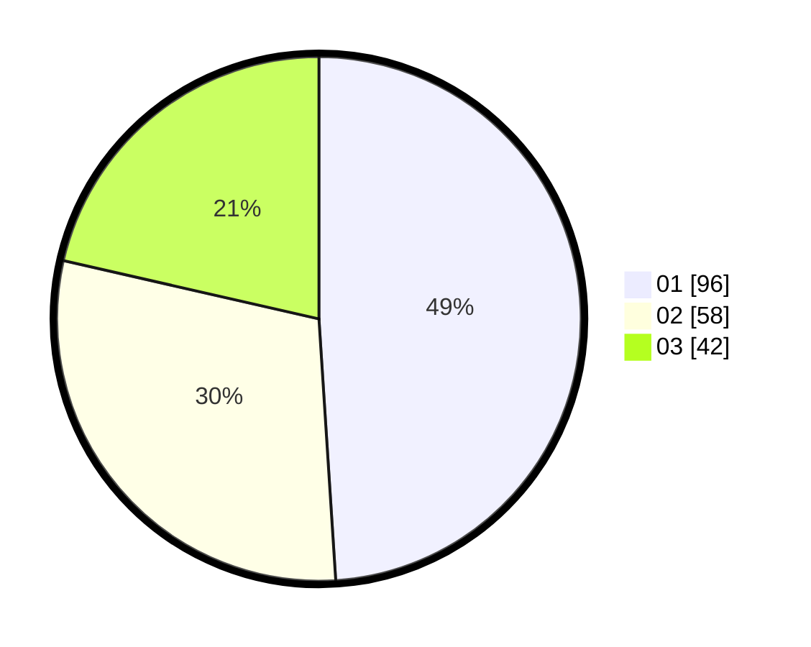

# Hasil

Hasil perolehan suara paslon dapat dilihat pada file paslon-01.txt, paslon-02.txt, dan paslon-03.txt.

Jika tidak ada, artinya data tersebut belum ada pada SIREKAP.

## Perolehan Suara

 * Paslon 01: **96**.
 * Paslon 02: **58**.
 * Paslon 03: **42**.

## Foto C Plano

https://sirekap-obj-formc.kpu.go.id/756e/pemilu/ppwp/31/75/07/10/02/3175071002130-20240214-184452--8238c6d2-4e6b-4594-b516-59f4f2321913.jpg

https://sirekap-obj-formc.kpu.go.id/756e/pemilu/ppwp/31/75/07/10/02/3175071002130-20240214-155747--e436a410-dcb5-41d6-a134-36982bc5e607.jpg

https://sirekap-obj-formc.kpu.go.id/756e/pemilu/ppwp/31/75/07/10/02/3175071002130-20240214-155547--c5ccb84e-27ca-4488-b416-c18714ae3f7a.jpg

## DATA PEMILIH TETAP

Jumlah pemilih dalam DPT: **238**.
 * L: **114**.
 * P: **124**.

## DATA PENGGUNA HAK PILIH

Jumlah pengguna hak pilih dalam DPT: **199**.
 * L: **93**.
 * P: **106**.

Jumlah pengguna hak pilih dalam DPTb: **2**.
 * L: **1**.
 * P: **1**.

Jumlah pengguna hak pilih dalam DPK: **0**.
 * L: **0**.
 * P: **0**.

Jumlah pengguna hak pilih: **201**.
 * L: **94**.
 * P: **107**.

## JUMLAH SUARA SAH DAN TIDAK SAH

JUMLAH SELURUH SUARA SAH: **196**.

JUMLAH SUARA TIDAK SAH: **5**.

JUMLAH SELURUH SUARA SAH DAN SUARA TIDAK SAH: **201**.
