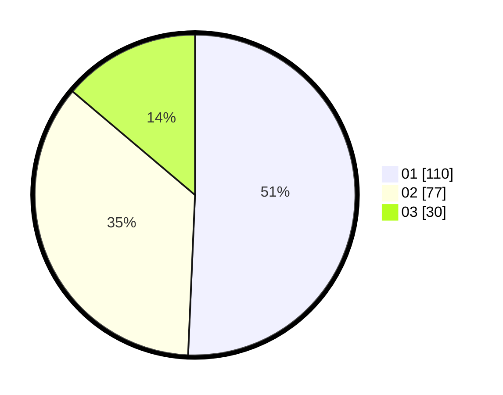

# Hasil

Hasil perolehan suara paslon dapat dilihat pada file paslon-01.txt, paslon-02.txt, dan paslon-03.txt.

Jika tidak ada, artinya data tersebut belum ada pada SIREKAP.

## Perolehan Suara

 * Paslon 01: **110**.
 * Paslon 02: **77**.
 * Paslon 03: **30**.

## Foto C Plano

https://sirekap-obj-formc.kpu.go.id/dbc7/pemilu/ppwp/31/75/07/10/02/3175071002132-20240215-024010--82bc18b7-963e-466c-9698-489c65406097.jpg

https://sirekap-obj-formc.kpu.go.id/dbc7/pemilu/ppwp/31/75/07/10/02/3175071002132-20240214-191046--a06d9d99-5fe6-4904-9730-41c754659d52.jpg

https://sirekap-obj-formc.kpu.go.id/dbc7/pemilu/ppwp/31/75/07/10/02/3175071002132-20240215-024515--df2dedc0-96ef-433f-b608-9b1e0c22ca75.jpg

## DATA PEMILIH TETAP

Jumlah pemilih dalam DPT: **275**.
 * L: **129**.
 * P: **146**.

## DATA PENGGUNA HAK PILIH

Jumlah pengguna hak pilih dalam DPT: **220**.
 * L: **100**.
 * P: **120**.

Jumlah pengguna hak pilih dalam DPTb: **1**.
 * L: **0**.
 * P: **1**.

Jumlah pengguna hak pilih dalam DPK: **3**.
 * L: **2**.
 * P: **1**.

Jumlah pengguna hak pilih: **224**.
 * L: **102**.
 * P: **122**.

## JUMLAH SUARA SAH DAN TIDAK SAH

JUMLAH SELURUH SUARA SAH: **217**.

JUMLAH SUARA TIDAK SAH: **7**.

JUMLAH SELURUH SUARA SAH DAN SUARA TIDAK SAH: **224**.
