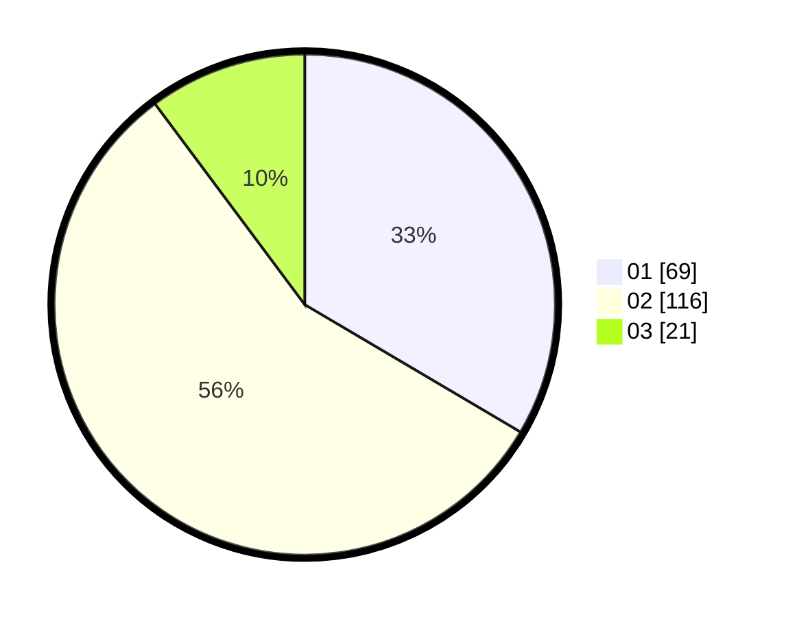

# Hasil

Hasil perolehan suara paslon dapat dilihat pada file paslon-01.txt, paslon-02.txt, dan paslon-03.txt.

Jika tidak ada, artinya data tersebut belum ada pada SIREKAP.

## Perolehan Suara

 * Paslon 01: **69**.
 * Paslon 02: **116**.
 * Paslon 03: **21**.

## Foto C Plano

https://sirekap-obj-formc.kpu.go.id/7d18/pemilu/ppwp/31/75/07/10/02/3175071002138-20240214-212359--936fc8b4-e817-44b5-9340-77727868a3ed.jpg

https://sirekap-obj-formc.kpu.go.id/7d18/pemilu/ppwp/31/75/07/10/02/3175071002138-20240214-212800--efcc13ef-dbdf-49fb-aa20-e318b573e896.jpg

https://sirekap-obj-formc.kpu.go.id/7d18/pemilu/ppwp/31/75/07/10/02/3175071002138-20240214-223958--9f58ac0e-9673-4b25-9d25-9785b26189f0.jpg
