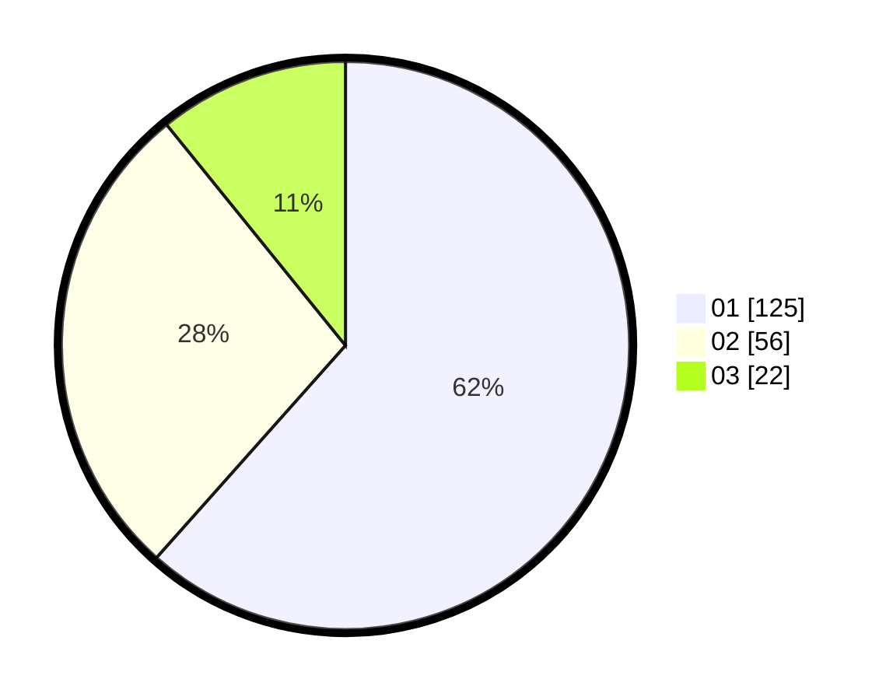

# Hasil

Hasil perolehan suara paslon dapat dilihat pada file paslon-01.txt, paslon-02.txt, dan paslon-03.txt.

Jika tidak ada, artinya data tersebut belum ada pada SIREKAP.

## Perolehan Suara

 * Paslon 01: **125**.
 * Paslon 02: **56**.
 * Paslon 03: **22**.

## Foto C Plano

https://sirekap-obj-formc.kpu.go.id/0734/pemilu/ppwp/31/75/07/10/02/3175071002139-20240215-233926--bd0b6697-b31e-4f06-924a-5b8142007c3b.jpg

https://sirekap-obj-formc.kpu.go.id/0734/pemilu/ppwp/31/75/07/10/02/3175071002139-20240215-233930--19b36477-ddfe-4dbb-9cb6-6a0c2a45dd1d.jpg

https://sirekap-obj-formc.kpu.go.id/0734/pemilu/ppwp/31/75/07/10/02/3175071002139-20240215-233927--9eaa4dbe-90de-43b4-9b6b-913c747f8db2.jpg

## DATA PEMILIH TETAP

Jumlah pemilih dalam DPT: **263**.
 * L: **136**.
 * P: **127**.

## DATA PENGGUNA HAK PILIH

Jumlah pengguna hak pilih dalam DPT: **187**.
 * L: **95**.
 * P: **92**.

Jumlah pengguna hak pilih dalam DPTb: **11**.
 * L: **7**.
 * P: **4**.

Jumlah pengguna hak pilih dalam DPK: **7**.
 * L: **4**.
 * P: **3**.

Jumlah pengguna hak pilih: **205**.
 * L: **106**.
 * P: **99**.

## JUMLAH SUARA SAH DAN TIDAK SAH

JUMLAH SELURUH SUARA SAH: **203**.

JUMLAH SUARA TIDAK SAH: **2**.

JUMLAH SELURUH SUARA SAH DAN SUARA TIDAK SAH: **205**.
