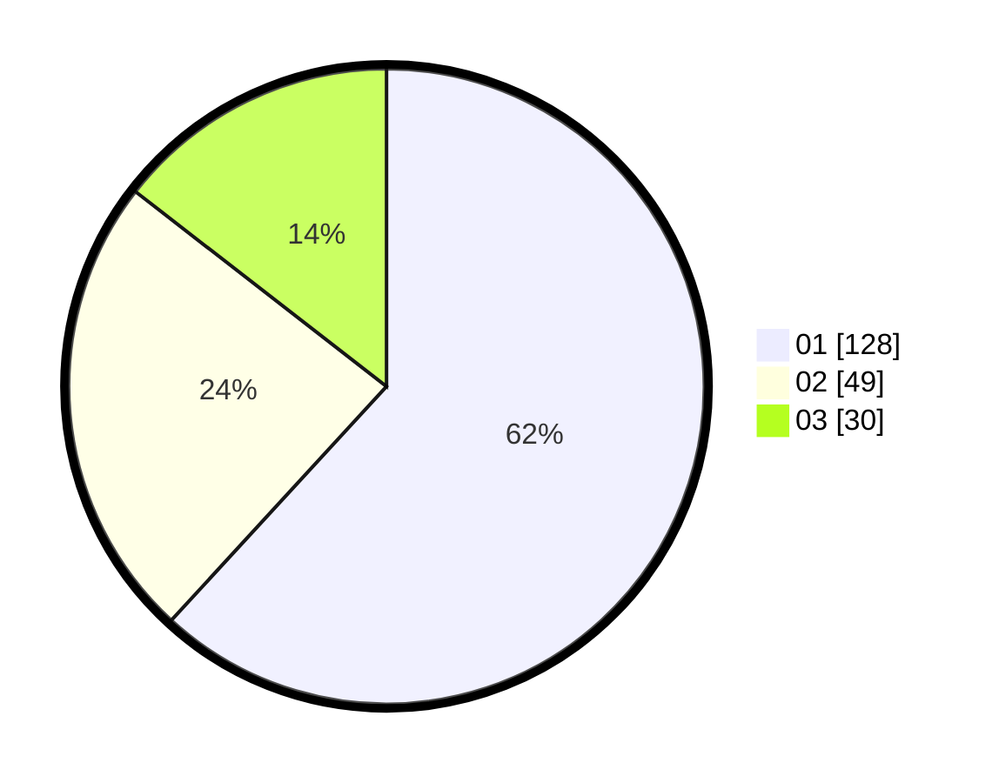

# Hasil

Hasil perolehan suara paslon dapat dilihat pada file paslon-01.txt, paslon-02.txt, dan paslon-03.txt.

Jika tidak ada, artinya data tersebut belum ada pada SIREKAP.

## Perolehan Suara

 * Paslon 01: **128**.
 * Paslon 02: **49**.
 * Paslon 03: **30**.

## Foto C Plano

https://sirekap-obj-formc.kpu.go.id/c1d8/pemilu/ppwp/31/75/07/10/02/3175071002140-20240214-192556--18a476ec-900a-426c-98a9-f5ab53b6f486.jpg

https://sirekap-obj-formc.kpu.go.id/c1d8/pemilu/ppwp/31/75/07/10/02/3175071002140-20240214-192706--e12ce65b-becc-4bea-8336-67669c640b56.jpg

https://sirekap-obj-formc.kpu.go.id/c1d8/pemilu/ppwp/31/75/07/10/02/3175071002140-20240214-192756--f0754c80-116c-40c5-ad8f-03121e3b213a.jpg

## DATA PEMILIH TETAP

Jumlah pemilih dalam DPT: **267**.
 * L: **128**.
 * P: **139**.

## DATA PENGGUNA HAK PILIH

Jumlah pengguna hak pilih dalam DPT: **201**.
 * L: **92**.
 * P: **109**.

Jumlah pengguna hak pilih dalam DPTb: **7**.
 * L: **2**.
 * P: **5**.

Jumlah pengguna hak pilih dalam DPK: **0**.
 * L: **1**.
 * P: **0**.

Jumlah pengguna hak pilih: **209**.
 * L: **95**.
 * P: **114**.

## JUMLAH SUARA SAH DAN TIDAK SAH

JUMLAH SELURUH SUARA SAH: **207**.

JUMLAH SUARA TIDAK SAH: **2**.

JUMLAH SELURUH SUARA SAH DAN SUARA TIDAK SAH: **209**.
