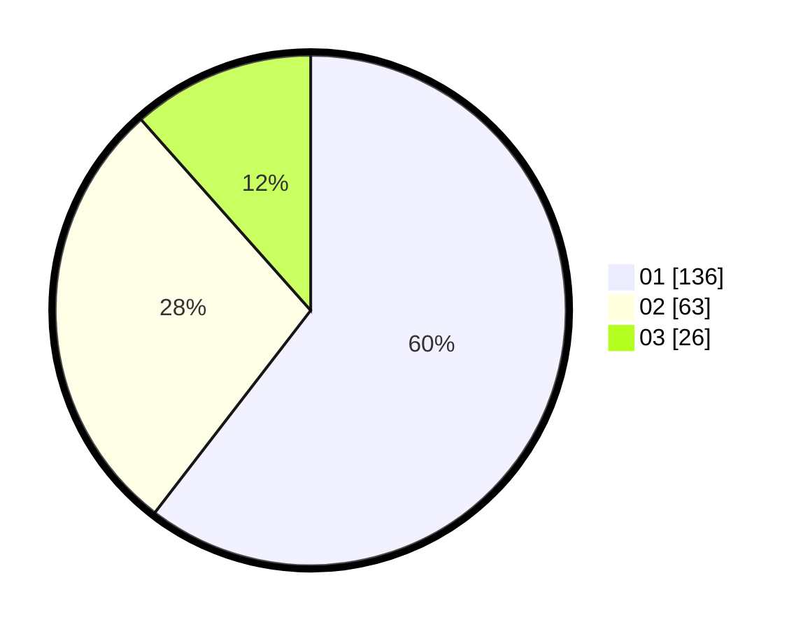

# Hasil

Hasil perolehan suara paslon dapat dilihat pada file paslon-01.txt, paslon-02.txt, dan paslon-03.txt.

Jika tidak ada, artinya data tersebut belum ada pada SIREKAP.

## Perolehan Suara

 * Paslon 01: **136**.
 * Paslon 02: **63**.
 * Paslon 03: **26**.

## Foto C Plano

https://sirekap-obj-formc.kpu.go.id/1d47/pemilu/ppwp/31/75/07/10/02/3175071002141-20240214-234026--51bae409-4628-4cd0-a3bc-2feaf2f62c98.jpg

https://sirekap-obj-formc.kpu.go.id/1d47/pemilu/ppwp/31/75/07/10/02/3175071002141-20240214-234357--d217402b-baf3-4090-b176-80fd83059f38.jpg

https://sirekap-obj-formc.kpu.go.id/1d47/pemilu/ppwp/31/75/07/10/02/3175071002141-20240214-234529--f32a1b41-6e75-4702-b51f-8932016ce328.jpg

## DATA PEMILIH TETAP

Jumlah pemilih dalam DPT: **269**.
 * L: **172**.
 * P: **137**.

## DATA PENGGUNA HAK PILIH

Jumlah pengguna hak pilih dalam DPT: **220**.
 * L: **104**.
 * P: **110**.

Jumlah pengguna hak pilih dalam DPTb: **0**.
 * L: **0**.
 * P: **0**.

Jumlah pengguna hak pilih dalam DPK: **5**.
 * L: **7**.
 * P: **2**.

Jumlah pengguna hak pilih: **225**.
 * L: **197**.
 * P: **110**.

## JUMLAH SUARA SAH DAN TIDAK SAH

JUMLAH SELURUH SUARA SAH: **225**.

JUMLAH SUARA TIDAK SAH: **0**.

JUMLAH SELURUH SUARA SAH DAN SUARA TIDAK SAH: **225**.
