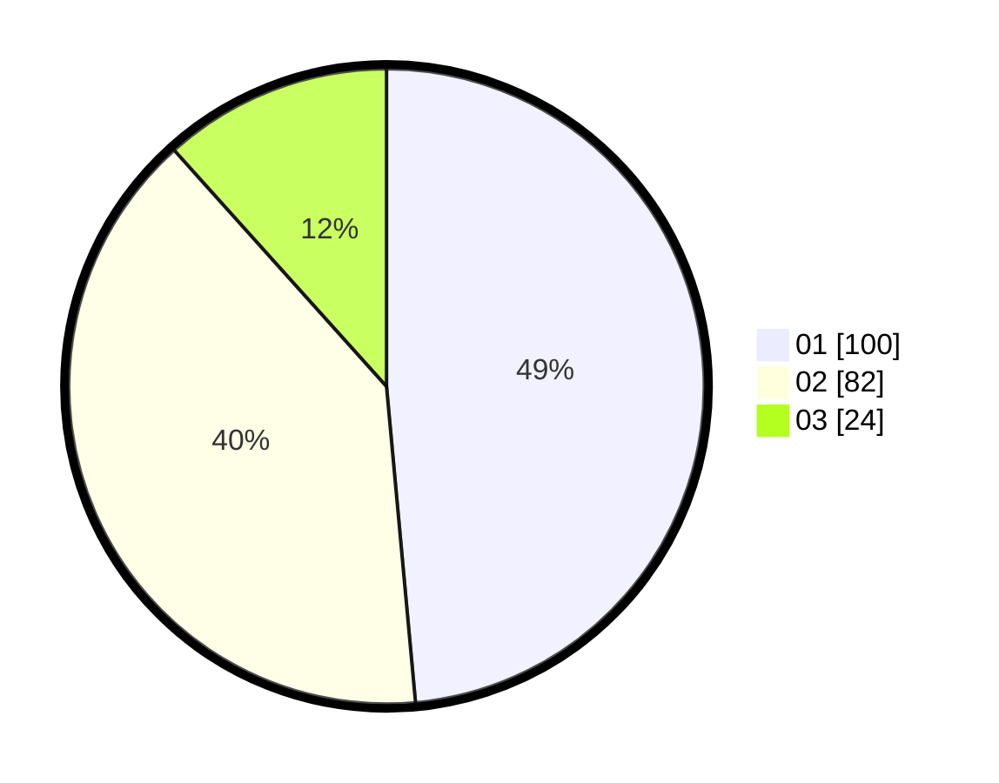

# Hasil

Hasil perolehan suara paslon dapat dilihat pada file paslon-01.txt, paslon-02.txt, dan paslon-03.txt.

Jika tidak ada, artinya data tersebut belum ada pada SIREKAP.

## Perolehan Suara

 * Paslon 01: **100**.
 * Paslon 02: **82**.
 * Paslon 03: **24**.

## Foto C Plano

https://sirekap-obj-formc.kpu.go.id/f1a1/pemilu/ppwp/31/75/07/10/02/3175071002145-20240214-185547--5bc75661-e53c-4a36-b7dd-7b56b8d7a765.jpg

https://sirekap-obj-formc.kpu.go.id/f1a1/pemilu/ppwp/31/75/07/10/02/3175071002145-20240214-185702--bb3af39b-cf9e-4a0b-a022-5ce42c7b03a7.jpg

https://sirekap-obj-formc.kpu.go.id/f1a1/pemilu/ppwp/31/75/07/10/02/3175071002145-20240214-185753--83de4f2b-0221-49f5-b19f-803828fdc2fd.jpg

## DATA PEMILIH TETAP

Jumlah pemilih dalam DPT: **262**.
 * L: **131**.
 * P: **131**.

## DATA PENGGUNA HAK PILIH

Jumlah pengguna hak pilih dalam DPT: **204**.
 * L: **102**.
 * P: **102**.

Jumlah pengguna hak pilih dalam DPTb: **2**.
 * L: **1**.
 * P: **1**.

Jumlah pengguna hak pilih dalam DPK: **0**.
 * L: **0**.
 * P: **0**.

Jumlah pengguna hak pilih: **206**.
 * L: **103**.
 * P: **103**.

## JUMLAH SUARA SAH DAN TIDAK SAH

JUMLAH SELURUH SUARA SAH: **206**.

JUMLAH SUARA TIDAK SAH: **0**.

JUMLAH SELURUH SUARA SAH DAN SUARA TIDAK SAH: **206**.
