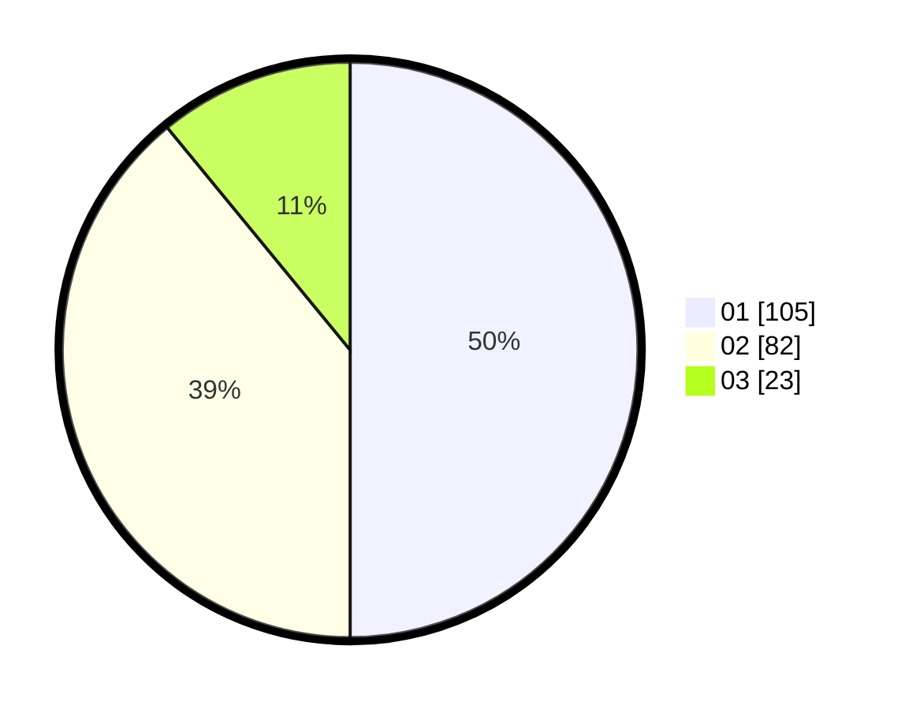

# Hasil

Hasil perolehan suara paslon dapat dilihat pada file paslon-01.txt, paslon-02.txt, dan paslon-03.txt.

Jika tidak ada, artinya data tersebut belum ada pada SIREKAP.

## Perolehan Suara

 * Paslon 01: **105**.
 * Paslon 02: **82**.
 * Paslon 03: **23**.

## Foto C Plano

https://sirekap-obj-formc.kpu.go.id/34e8/pemilu/ppwp/31/75/07/10/02/3175071002146-20240214-155225--b0681b13-1a91-4e2f-97af-e413af3cd066.jpg

https://sirekap-obj-formc.kpu.go.id/34e8/pemilu/ppwp/31/75/07/10/02/3175071002146-20240214-155144--4052a7f9-663e-44fe-a760-97407c95cbea.jpg

https://sirekap-obj-formc.kpu.go.id/34e8/pemilu/ppwp/31/75/07/10/02/3175071002146-20240214-155355--e831f622-6d24-4323-b837-7a95f94baf8e.jpg

## DATA PEMILIH TETAP

Jumlah pemilih dalam DPT: **266**.
 * L: **129**.
 * P: **137**.

## DATA PENGGUNA HAK PILIH

Jumlah pengguna hak pilih dalam DPT: **211**.
 * L: **101**.
 * P: **110**.

Jumlah pengguna hak pilih dalam DPTb: **1**.
 * L: **0**.
 * P: **1**.

Jumlah pengguna hak pilih dalam DPK: **1**.
 * L: **1**.
 * P: **0**.

Jumlah pengguna hak pilih: **213**.
 * L: **102**.
 * P: **111**.

## JUMLAH SUARA SAH DAN TIDAK SAH

JUMLAH SELURUH SUARA SAH: **210**.

JUMLAH SUARA TIDAK SAH: **3**.

JUMLAH SELURUH SUARA SAH DAN SUARA TIDAK SAH: **213**.
