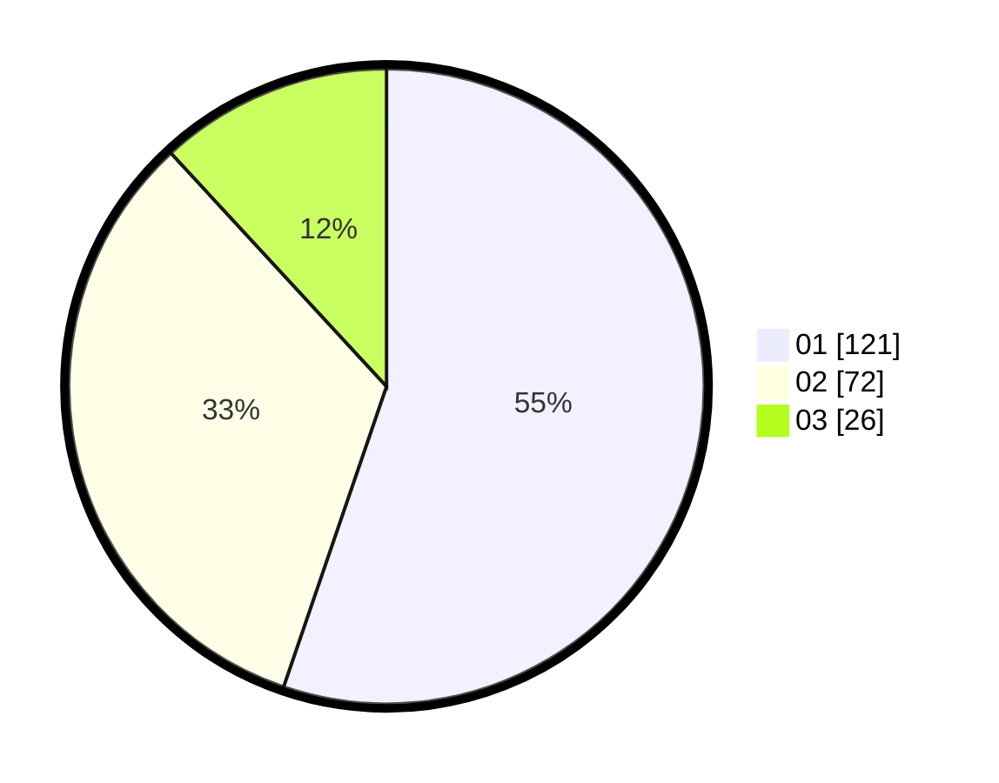

# Hasil

Hasil perolehan suara paslon dapat dilihat pada file paslon-01.txt, paslon-02.txt, dan paslon-03.txt.

Jika tidak ada, artinya data tersebut belum ada pada SIREKAP.

## Perolehan Suara

 * Paslon 01: **121**.
 * Paslon 02: **72**.
 * Paslon 03: **26**.

## Foto C Plano

https://sirekap-obj-formc.kpu.go.id/0739/pemilu/ppwp/31/75/07/10/02/3175071002152-20240216-070106--5e673698-b8de-4f9f-9691-6101e6f33435.jpg

https://sirekap-obj-formc.kpu.go.id/0739/pemilu/ppwp/31/75/07/10/02/3175071002152-20240218-191439--3e7139b0-9078-4cc1-b7c6-57534b64f219.jpg

https://sirekap-obj-formc.kpu.go.id/0739/pemilu/ppwp/31/75/07/10/02/3175071002152-20240219-083240--0198c189-73da-4afe-8b8b-e94cf7fb5bfe.jpg
