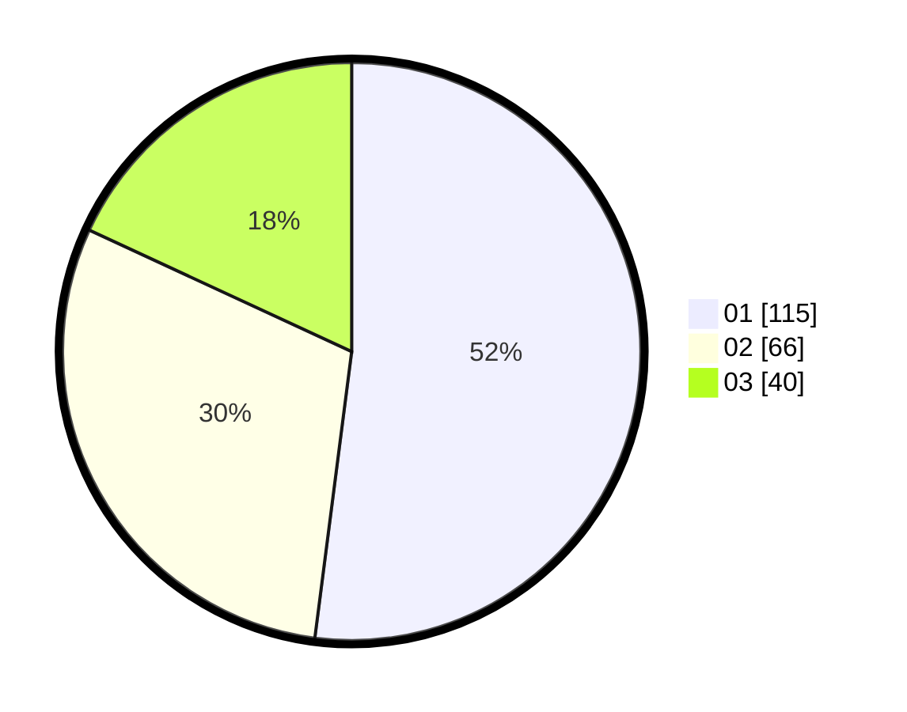

# Hasil

Hasil perolehan suara paslon dapat dilihat pada file paslon-01.txt, paslon-02.txt, dan paslon-03.txt.

Jika tidak ada, artinya data tersebut belum ada pada SIREKAP.

## Perolehan Suara

 * Paslon 01: **115**.
 * Paslon 02: **66**.
 * Paslon 03: **40**.

## Foto C Plano

https://sirekap-obj-formc.kpu.go.id/0879/pemilu/ppwp/31/75/07/10/02/3175071002154-20240215-000843--c8dcaa5f-cc08-4923-a359-dd1764239c84.jpg

https://sirekap-obj-formc.kpu.go.id/0879/pemilu/ppwp/31/75/07/10/02/3175071002154-20240215-001022--330d60bd-2db9-433c-93a1-c4c8b0fc9c05.jpg

https://sirekap-obj-formc.kpu.go.id/0879/pemilu/ppwp/31/75/07/10/02/3175071002154-20240215-001141--ed1264d4-f3fd-4626-a6ca-632933fcefc7.jpg
