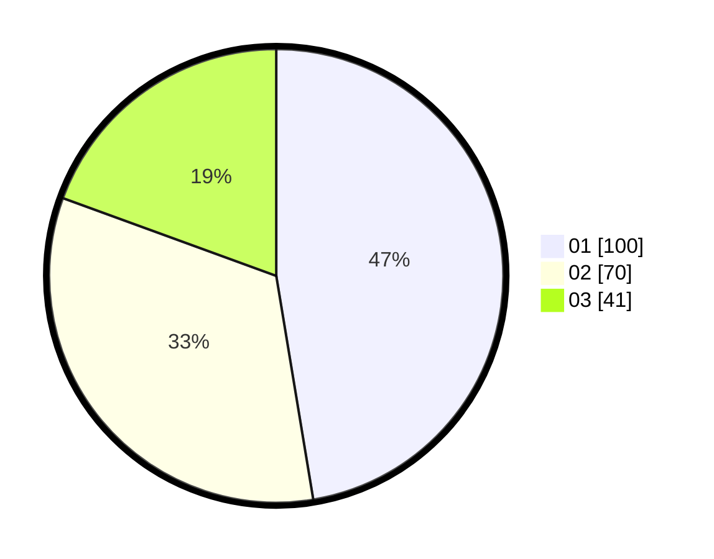

# Hasil

Hasil perolehan suara paslon dapat dilihat pada file paslon-01.txt, paslon-02.txt, dan paslon-03.txt.

Jika tidak ada, artinya data tersebut belum ada pada SIREKAP.

## Perolehan Suara

 * Paslon 01: **100**.
 * Paslon 02: **70**.
 * Paslon 03: **41**.

## Foto C Plano

https://sirekap-obj-formc.kpu.go.id/3b41/pemilu/ppwp/31/75/07/10/02/3175071002156-20240214-185605--8c6fe152-277d-4eec-be3b-7481d6b4f086.jpg

https://sirekap-obj-formc.kpu.go.id/3b41/pemilu/ppwp/31/75/07/10/02/3175071002156-20240214-220322--28978f9b-c7a2-477f-b0f4-bfd26d5d06fe.jpg

https://sirekap-obj-formc.kpu.go.id/3b41/pemilu/ppwp/31/75/07/10/02/3175071002156-20240214-223039--272a654b-c986-4977-9609-68f7271c5b03.jpg

## DATA PEMILIH TETAP

Jumlah pemilih dalam DPT: **269**.
 * L: **132**.
 * P: **137**.

## DATA PENGGUNA HAK PILIH

Jumlah pengguna hak pilih dalam DPT: **214**.
 * L: **102**.
 * P: **112**.

Jumlah pengguna hak pilih dalam DPTb: **1**.
 * L: **1**.
 * P: **0**.

Jumlah pengguna hak pilih dalam DPK: **0**.
 * L: **0**.
 * P: **0**.

Jumlah pengguna hak pilih: **215**.
 * L: **103**.
 * P: **112**.

## JUMLAH SUARA SAH DAN TIDAK SAH

JUMLAH SELURUH SUARA SAH: **211**.

JUMLAH SUARA TIDAK SAH: **4**.

JUMLAH SELURUH SUARA SAH DAN SUARA TIDAK SAH: **215**.
