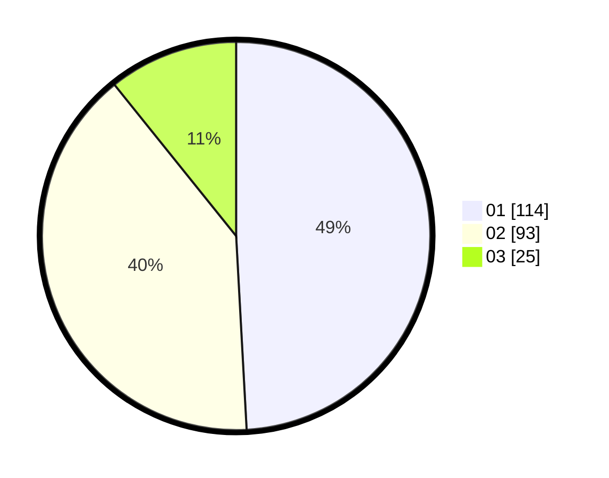

# Hasil

Hasil perolehan suara paslon dapat dilihat pada file paslon-01.txt, paslon-02.txt, dan paslon-03.txt.

Jika tidak ada, artinya data tersebut belum ada pada SIREKAP.

## Perolehan Suara

 * Paslon 01: **114**.
 * Paslon 02: **93**.
 * Paslon 03: **25**.

## Foto C Plano

https://sirekap-obj-formc.kpu.go.id/e806/pemilu/ppwp/31/75/07/10/02/3175071002159-20240214-223350--62c93989-661d-4da9-ab2b-f52f644538f9.jpg

https://sirekap-obj-formc.kpu.go.id/e806/pemilu/ppwp/31/75/07/10/02/3175071002159-20240214-223356--a8eb461f-371a-4642-8f2c-449267156c52.jpg

https://sirekap-obj-formc.kpu.go.id/e806/pemilu/ppwp/31/75/07/10/02/3175071002159-20240214-223403--cd5164b8-e6d1-4c77-b48b-7b5d82f83a31.jpg
