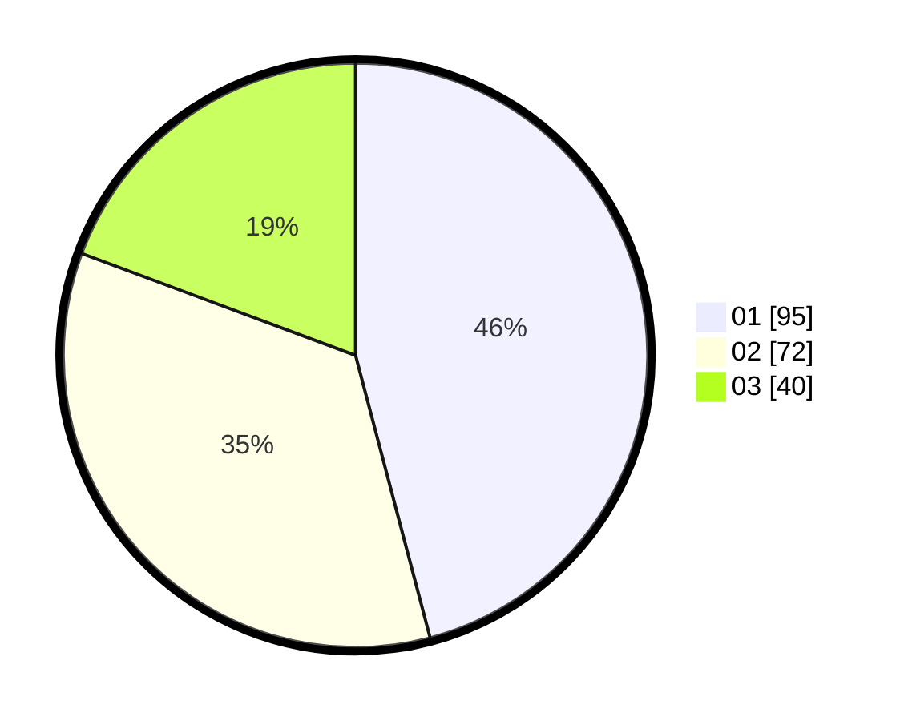

# Hasil

Hasil perolehan suara paslon dapat dilihat pada file paslon-01.txt, paslon-02.txt, dan paslon-03.txt.

Jika tidak ada, artinya data tersebut belum ada pada SIREKAP.

## Perolehan Suara

 * Paslon 01: **95**.
 * Paslon 02: **72**.
 * Paslon 03: **40**.

## Foto C Plano

https://sirekap-obj-formc.kpu.go.id/ff89/pemilu/ppwp/31/75/07/10/02/3175071002162-20240214-185734--24ce4c1e-c733-47e0-921f-adacded60ff9.jpg

https://sirekap-obj-formc.kpu.go.id/ff89/pemilu/ppwp/31/75/07/10/02/3175071002162-20240214-185739--2731b49d-cb12-48f2-a223-dde330009413.jpg

https://sirekap-obj-formc.kpu.go.id/ff89/pemilu/ppwp/31/75/07/10/02/3175071002162-20240214-185744--da649dac-e7af-4ef6-9136-787a033b14f0.jpg

## DATA PEMILIH TETAP

Jumlah pemilih dalam DPT: **268**.
 * L: **135**.
 * P: **133**.

## DATA PENGGUNA HAK PILIH

Jumlah pengguna hak pilih dalam DPT: **204**.
 * L: **98**.
 * P: **106**.

Jumlah pengguna hak pilih dalam DPTb: **3**.
 * L: **1**.
 * P: **2**.

Jumlah pengguna hak pilih dalam DPK: **3**.
 * L: **3**.
 * P: **0**.

Jumlah pengguna hak pilih: **210**.
 * L: **102**.
 * P: **108**.

## JUMLAH SUARA SAH DAN TIDAK SAH

JUMLAH SELURUH SUARA SAH: **207**.

JUMLAH SUARA TIDAK SAH: **3**.

JUMLAH SELURUH SUARA SAH DAN SUARA TIDAK SAH: **210**.
