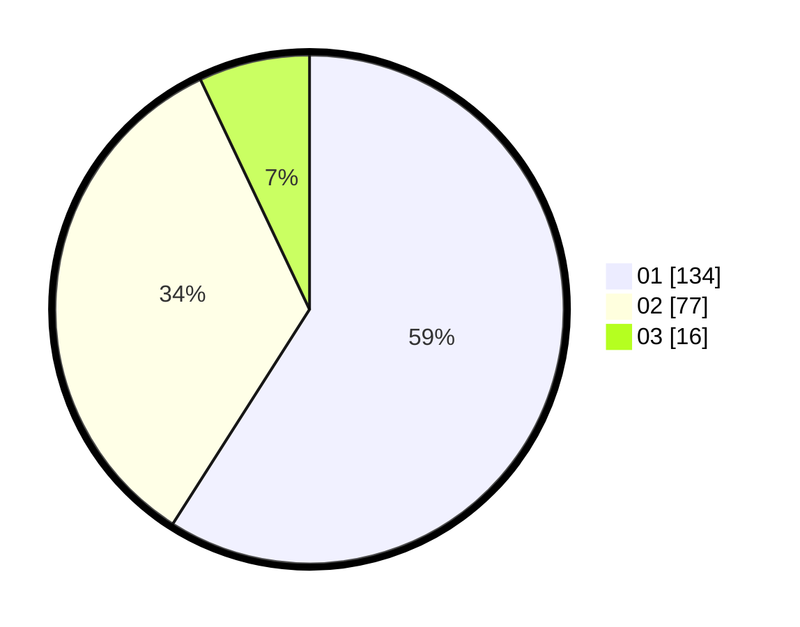

# Hasil

Hasil perolehan suara paslon dapat dilihat pada file paslon-01.txt, paslon-02.txt, dan paslon-03.txt.

Jika tidak ada, artinya data tersebut belum ada pada SIREKAP.

## Perolehan Suara

 * Paslon 01: **134**.
 * Paslon 02: **77**.
 * Paslon 03: **16**.

## Foto C Plano

https://sirekap-obj-formc.kpu.go.id/5422/pemilu/ppwp/31/75/07/10/02/3175071002165-20240214-215705--2732d5bc-6e11-4471-bc6c-de9bb0ed01e8.jpg

https://sirekap-obj-formc.kpu.go.id/5422/pemilu/ppwp/31/75/07/10/02/3175071002165-20240214-215743--006874cc-d361-4b26-bb14-3b49cb06e683.jpg

https://sirekap-obj-formc.kpu.go.id/5422/pemilu/ppwp/31/75/07/10/02/3175071002165-20240214-220049--e9e85836-b527-4b0f-9f7d-970339f58db5.jpg

## DATA PEMILIH TETAP

Jumlah pemilih dalam DPT: **265**.
 * L: **131**.
 * P: **134**.

## DATA PENGGUNA HAK PILIH

Jumlah pengguna hak pilih dalam DPT: **223**.
 * L: **111**.
 * P: **112**.

Jumlah pengguna hak pilih dalam DPTb: **1**.
 * L: **0**.
 * P: **1**.

Jumlah pengguna hak pilih dalam DPK: **5**.
 * L: **1**.
 * P: **4**.

Jumlah pengguna hak pilih: **229**.
 * L: **112**.
 * P: **117**.

## JUMLAH SUARA SAH DAN TIDAK SAH

JUMLAH SELURUH SUARA SAH: **227**.

JUMLAH SUARA TIDAK SAH: **2**.

JUMLAH SELURUH SUARA SAH DAN SUARA TIDAK SAH: **229**.
