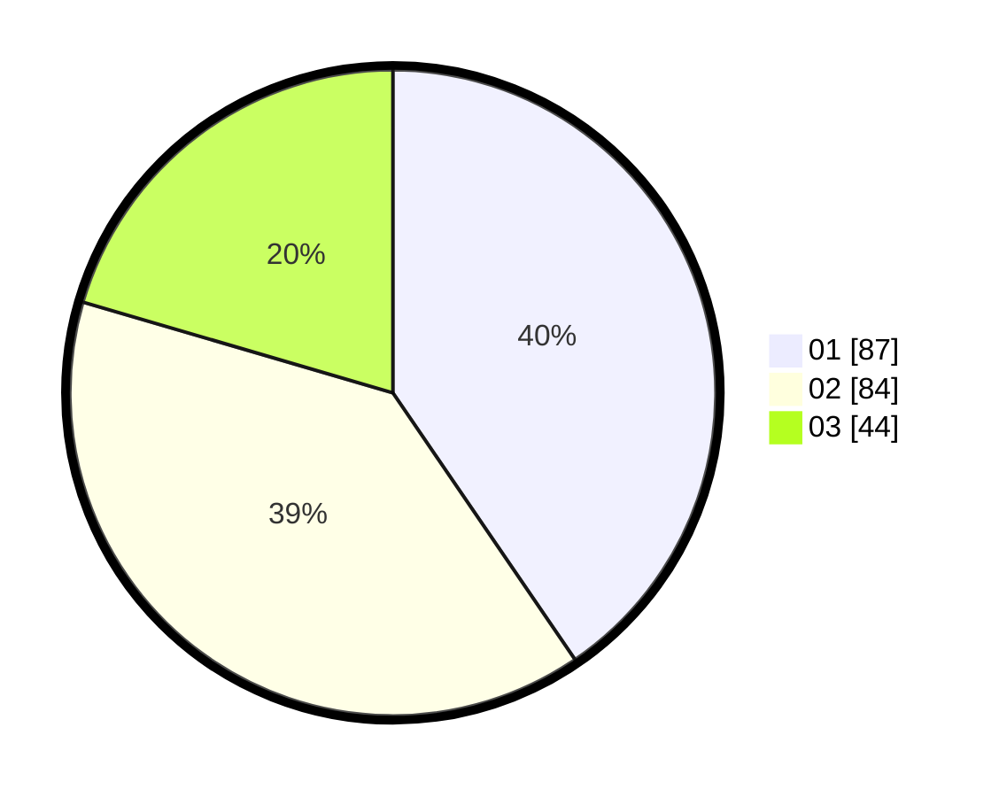

# Hasil

Hasil perolehan suara paslon dapat dilihat pada file paslon-01.txt, paslon-02.txt, dan paslon-03.txt.

Jika tidak ada, artinya data tersebut belum ada pada SIREKAP.

## Perolehan Suara

 * Paslon 01: **87**.
 * Paslon 02: **84**.
 * Paslon 03: **44**.

## Foto C Plano

https://sirekap-obj-formc.kpu.go.id/e293/pemilu/ppwp/31/75/07/10/02/3175071002177-20240214-185852--de17e215-1022-4a86-9154-daeaa098215c.jpg

https://sirekap-obj-formc.kpu.go.id/e293/pemilu/ppwp/31/75/07/10/02/3175071002177-20240214-185909--76e2f3ff-62e3-46ea-89d7-6b7adcc13820.jpg

https://sirekap-obj-formc.kpu.go.id/e293/pemilu/ppwp/31/75/07/10/02/3175071002177-20240214-185925--74301b99-df79-4bc7-8e78-bf90f21ad187.jpg

## DATA PEMILIH TETAP

Jumlah pemilih dalam DPT: **273**.
 * L: **137**.
 * P: **136**.

## DATA PENGGUNA HAK PILIH

Jumlah pengguna hak pilih dalam DPT: **208**.
 * L: **102**.
 * P: **106**.

Jumlah pengguna hak pilih dalam DPTb: **9**.
 * L: **4**.
 * P: **5**.

Jumlah pengguna hak pilih dalam DPK: **4**.
 * L: **2**.
 * P: **2**.

Jumlah pengguna hak pilih: **221**.
 * L: **108**.
 * P: **113**.

## JUMLAH SUARA SAH DAN TIDAK SAH

JUMLAH SELURUH SUARA SAH: **215**.

JUMLAH SUARA TIDAK SAH: **6**.

JUMLAH SELURUH SUARA SAH DAN SUARA TIDAK SAH: **221**.
