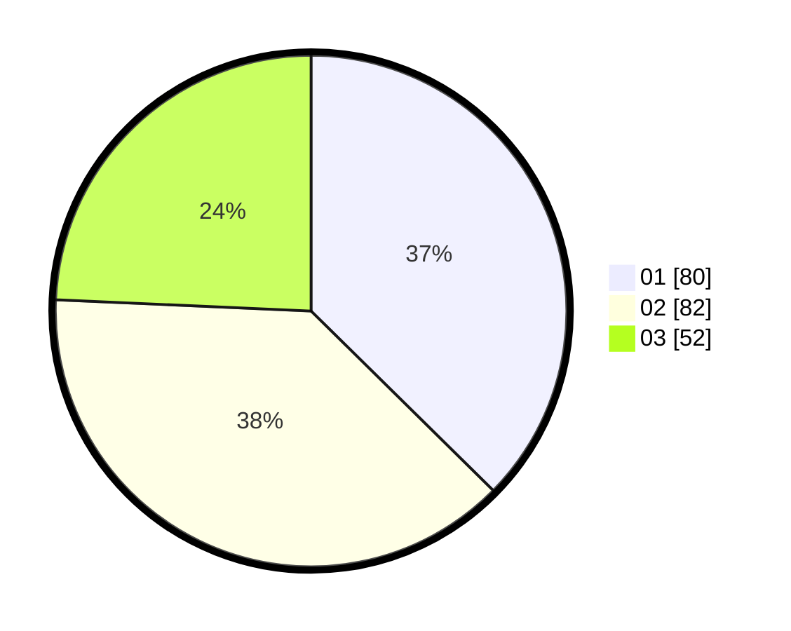

# Hasil

Hasil perolehan suara paslon dapat dilihat pada file paslon-01.txt, paslon-02.txt, dan paslon-03.txt.

Jika tidak ada, artinya data tersebut belum ada pada SIREKAP.

## Perolehan Suara

 * Paslon 01: **80**.
 * Paslon 02: **82**.
 * Paslon 03: **52**.

## Foto C Plano

https://sirekap-obj-formc.kpu.go.id/e0c8/pemilu/ppwp/31/75/07/10/02/3175071002178-20240215-021245--fe00f2ec-6d85-427c-88d9-fc8c93d3da63.jpg

https://sirekap-obj-formc.kpu.go.id/e0c8/pemilu/ppwp/31/75/07/10/02/3175071002178-20240214-193001--fb51e1b7-f994-4c33-a7c1-338fab58833b.jpg

https://sirekap-obj-formc.kpu.go.id/e0c8/pemilu/ppwp/31/75/07/10/02/3175071002178-20240214-193142--8edab32b-631e-4a2b-b02f-7734731b6137.jpg

## DATA PEMILIH TETAP

Jumlah pemilih dalam DPT: **270**.
 * L: **124**.
 * P: **146**.

## DATA PENGGUNA HAK PILIH

Jumlah pengguna hak pilih dalam DPT: **201**.
 * L: **93**.
 * P: **108**.

Jumlah pengguna hak pilih dalam DPTb: **13**.
 * L: **7**.
 * P: **6**.

Jumlah pengguna hak pilih dalam DPK: **3**.
 * L: **1**.
 * P: **2**.

Jumlah pengguna hak pilih: **217**.
 * L: **101**.
 * P: **116**.

## JUMLAH SUARA SAH DAN TIDAK SAH

JUMLAH SELURUH SUARA SAH: **214**.

JUMLAH SUARA TIDAK SAH: **3**.

JUMLAH SELURUH SUARA SAH DAN SUARA TIDAK SAH: **217**.
