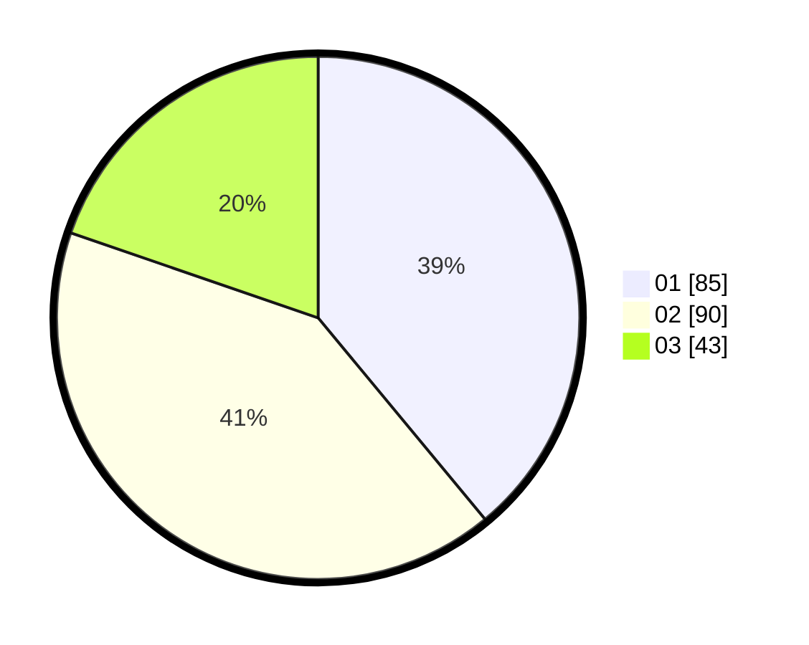

# Hasil

Hasil perolehan suara paslon dapat dilihat pada file paslon-01.txt, paslon-02.txt, dan paslon-03.txt.

Jika tidak ada, artinya data tersebut belum ada pada SIREKAP.

## Perolehan Suara

 * Paslon 01: **85**.
 * Paslon 02: **90**.
 * Paslon 03: **43**.

## Foto C Plano

https://sirekap-obj-formc.kpu.go.id/6480/pemilu/ppwp/31/75/07/10/02/3175071002180-20240215-002134--443ef937-ca41-423c-ac37-d218830aa9b0.jpg

https://sirekap-obj-formc.kpu.go.id/6480/pemilu/ppwp/31/75/07/10/02/3175071002180-20240215-002321--d47d9ce9-e3da-40f7-86b5-18eda8b9aa1f.jpg

https://sirekap-obj-formc.kpu.go.id/6480/pemilu/ppwp/31/75/07/10/02/3175071002180-20240215-002429--bdc82997-e457-4ac4-8c75-aba128e93707.jpg

## DATA PEMILIH TETAP

Jumlah pemilih dalam DPT: **264**.
 * L: **111**.
 * P: **153**.

## DATA PENGGUNA HAK PILIH

Jumlah pengguna hak pilih dalam DPT: **213**.
 * L: **86**.
 * P: **127**.

Jumlah pengguna hak pilih dalam DPTb: **4**.
 * L: **1**.
 * P: **3**.

Jumlah pengguna hak pilih dalam DPK: **2**.
 * L: **1**.
 * P: **1**.

Jumlah pengguna hak pilih: **219**.
 * L: **88**.
 * P: **131**.

## JUMLAH SUARA SAH DAN TIDAK SAH

JUMLAH SELURUH SUARA SAH: **218**.

JUMLAH SUARA TIDAK SAH: **1**.

JUMLAH SELURUH SUARA SAH DAN SUARA TIDAK SAH: **219**.
