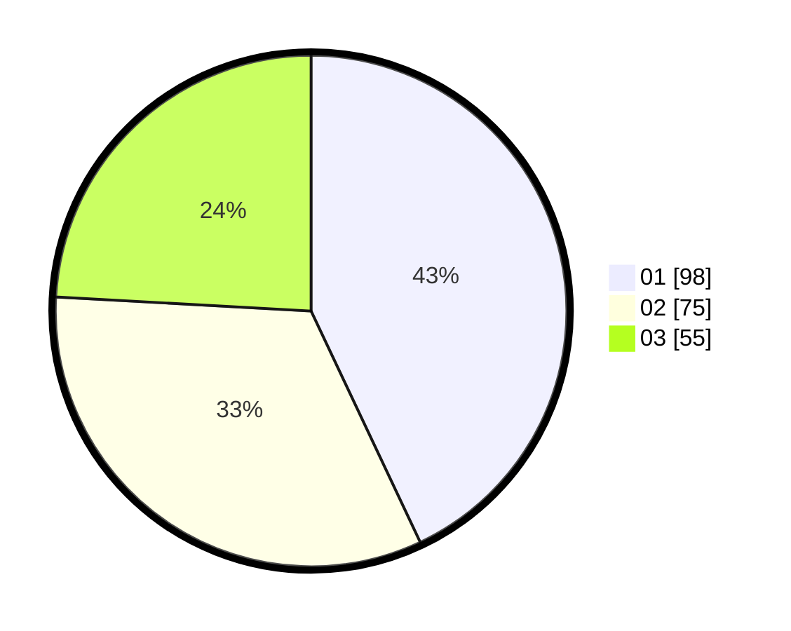

# Hasil

Hasil perolehan suara paslon dapat dilihat pada file paslon-01.txt, paslon-02.txt, dan paslon-03.txt.

Jika tidak ada, artinya data tersebut belum ada pada SIREKAP.

## Perolehan Suara

 * Paslon 01: **98**.
 * Paslon 02: **75**.
 * Paslon 03: **55**.

## Foto C Plano

https://sirekap-obj-formc.kpu.go.id/6796/pemilu/ppwp/31/75/07/10/02/3175071002185-20240214-191236--5c479d53-469a-4944-b6fb-de52e5467741.jpg

https://sirekap-obj-formc.kpu.go.id/6796/pemilu/ppwp/31/75/07/10/02/3175071002185-20240214-191427--a965ee3d-dd95-4ae8-923b-1cb72dd352be.jpg

https://sirekap-obj-formc.kpu.go.id/6796/pemilu/ppwp/31/75/07/10/02/3175071002185-20240214-191440--1635bca6-a137-4cf7-9a7d-21ad991c5ab4.jpg
