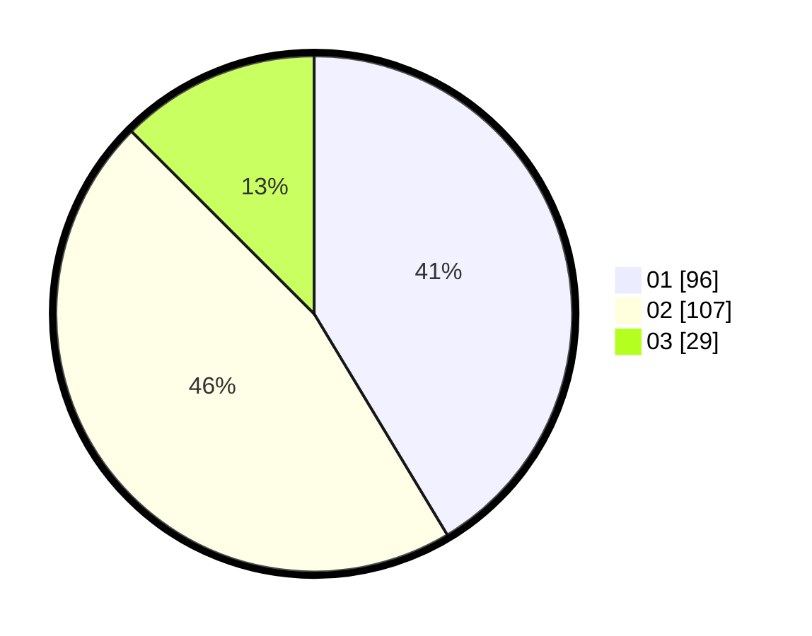

# Hasil

Hasil perolehan suara paslon dapat dilihat pada file paslon-01.txt, paslon-02.txt, dan paslon-03.txt.

Jika tidak ada, artinya data tersebut belum ada pada SIREKAP.

## Perolehan Suara

 * Paslon 01: **96**.
 * Paslon 02: **107**.
 * Paslon 03: **29**.

## Foto C Plano

https://sirekap-obj-formc.kpu.go.id/4515/pemilu/ppwp/31/75/07/10/02/3175071002187-20240216-132910--c03cd070-7261-40cb-9b2c-541c056c9698.jpg

https://sirekap-obj-formc.kpu.go.id/4515/pemilu/ppwp/31/75/07/10/02/3175071002187-20240216-132912--5cd5c958-d33f-4bf0-a126-1bdb522b026f.jpg

https://sirekap-obj-formc.kpu.go.id/4515/pemilu/ppwp/31/75/07/10/02/3175071002187-20240216-132911--9d9845c4-6248-4a13-bc6b-caab385c58c8.jpg

## DATA PEMILIH TETAP

Jumlah pemilih dalam DPT: **284**.
 * L: **134**.
 * P: **150**.

## DATA PENGGUNA HAK PILIH

Jumlah pengguna hak pilih dalam DPT: **234**.
 * L: **105**.
 * P: **129**.

Jumlah pengguna hak pilih dalam DPTb: **0**.
 * L: **0**.
 * P: **0**.

Jumlah pengguna hak pilih dalam DPK: **1**.
 * L: **0**.
 * P: **1**.

Jumlah pengguna hak pilih: **235**.
 * L: **105**.
 * P: **130**.

## JUMLAH SUARA SAH DAN TIDAK SAH

JUMLAH SELURUH SUARA SAH: **232**.

JUMLAH SUARA TIDAK SAH: **3**.

JUMLAH SELURUH SUARA SAH DAN SUARA TIDAK SAH: **235**.
