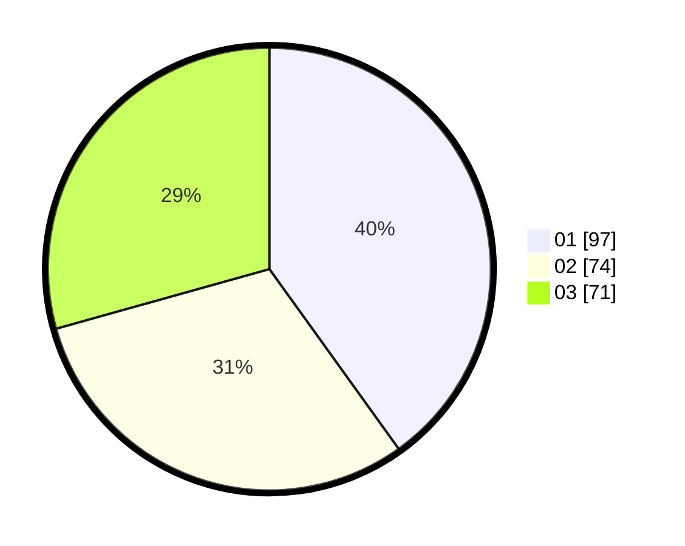

# Hasil

Hasil perolehan suara paslon dapat dilihat pada file paslon-01.txt, paslon-02.txt, dan paslon-03.txt.

Jika tidak ada, artinya data tersebut belum ada pada SIREKAP.

## Perolehan Suara

 * Paslon 01: **97**.
 * Paslon 02: **74**.
 * Paslon 03: **71**.

## Foto C Plano

https://sirekap-obj-formc.kpu.go.id/8541/pemilu/ppwp/31/75/07/10/02/3175071002191-20240216-040755--ec636c99-c13d-41e0-b62d-1391d2c21fe6.jpg

https://sirekap-obj-formc.kpu.go.id/8541/pemilu/ppwp/31/75/07/10/02/3175071002191-20240216-040801--ff8b8a18-d3ab-4942-a824-cae219a5f208.jpg

https://sirekap-obj-formc.kpu.go.id/8541/pemilu/ppwp/31/75/07/10/02/3175071002191-20240216-040758--20035bd6-2e9c-44a0-aa03-31ad957006e3.jpg

## DATA PEMILIH TETAP

Jumlah pemilih dalam DPT: **283**.
 * L: **138**.
 * P: **145**.

## DATA PENGGUNA HAK PILIH

Jumlah pengguna hak pilih dalam DPT: **237**.
 * L: **111**.
 * P: **126**.

Jumlah pengguna hak pilih dalam DPTb: **0**.
 * L: **0**.
 * P: **0**.

Jumlah pengguna hak pilih dalam DPK: **5**.
 * L: **3**.
 * P: **2**.

Jumlah pengguna hak pilih: **242**.
 * L: **114**.
 * P: **128**.

## JUMLAH SUARA SAH DAN TIDAK SAH

JUMLAH SELURUH SUARA SAH: **242**.

JUMLAH SUARA TIDAK SAH: **0**.

JUMLAH SELURUH SUARA SAH DAN SUARA TIDAK SAH: **242**.
