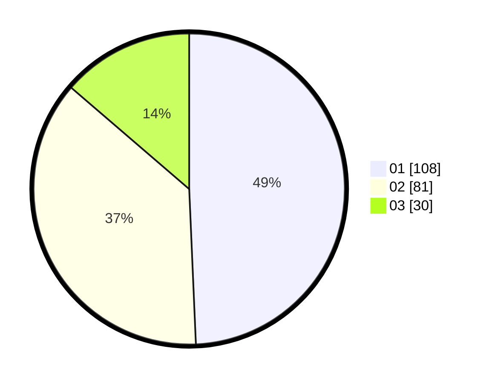

# Hasil

Hasil perolehan suara paslon dapat dilihat pada file paslon-01.txt, paslon-02.txt, dan paslon-03.txt.

Jika tidak ada, artinya data tersebut belum ada pada SIREKAP.

## Perolehan Suara

 * Paslon 01: **108**.
 * Paslon 02: **81**.
 * Paslon 03: **30**.

## Foto C Plano

https://sirekap-obj-formc.kpu.go.id/a4aa/pemilu/ppwp/31/75/07/10/02/3175071002194-20240214-210658--e35d06e9-5049-4d8b-85f9-4b22763fe4f1.jpg

https://sirekap-obj-formc.kpu.go.id/a4aa/pemilu/ppwp/31/75/07/10/02/3175071002194-20240214-210825--e2ba9a17-f050-42a6-a3b9-68bd11686cd1.jpg

https://sirekap-obj-formc.kpu.go.id/a4aa/pemilu/ppwp/31/75/07/10/02/3175071002194-20240214-211157--e24604bb-7525-4030-9960-e77613d93b0c.jpg

## DATA PEMILIH TETAP

Jumlah pemilih dalam DPT: **271**.
 * L: **120**.
 * P: **151**.

## DATA PENGGUNA HAK PILIH

Jumlah pengguna hak pilih dalam DPT: **218**.
 * L: **100**.
 * P: **118**.

Jumlah pengguna hak pilih dalam DPTb: **1**.
 * L: **0**.
 * P: **1**.

Jumlah pengguna hak pilih dalam DPK: **0**.
 * L: **0**.
 * P: **0**.

Jumlah pengguna hak pilih: **219**.
 * L: **100**.
 * P: **119**.

## JUMLAH SUARA SAH DAN TIDAK SAH

JUMLAH SELURUH SUARA SAH: **219**.

JUMLAH SUARA TIDAK SAH: **0**.

JUMLAH SELURUH SUARA SAH DAN SUARA TIDAK SAH: **219**.
