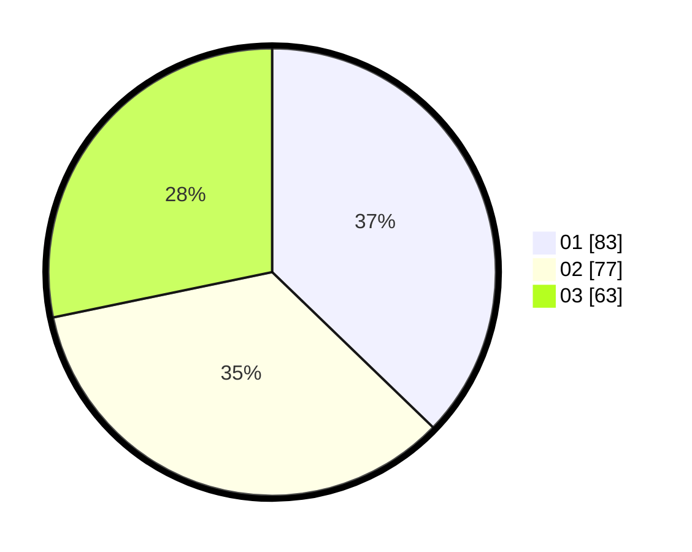

# Hasil

Hasil perolehan suara paslon dapat dilihat pada file paslon-01.txt, paslon-02.txt, dan paslon-03.txt.

Jika tidak ada, artinya data tersebut belum ada pada SIREKAP.

## Perolehan Suara

 * Paslon 01: **83**.
 * Paslon 02: **77**.
 * Paslon 03: **63**.

## Foto C Plano

https://sirekap-obj-formc.kpu.go.id/d30c/pemilu/ppwp/31/75/07/10/02/3175071002200-20240215-014448--53c5e88c-8805-4d30-8239-4b134b8b553d.jpg

https://sirekap-obj-formc.kpu.go.id/d30c/pemilu/ppwp/31/75/07/10/02/3175071002200-20240215-014716--ed0be685-531b-4f2b-9ae1-1055b0569f31.jpg

https://sirekap-obj-formc.kpu.go.id/d30c/pemilu/ppwp/31/75/07/10/02/3175071002200-20240215-014758--f4e3146e-ccc2-4d55-9b8d-807c3e50e3d4.jpg

## DATA PEMILIH TETAP

Jumlah pemilih dalam DPT: **272**.
 * L: **131**.
 * P: **141**.

## DATA PENGGUNA HAK PILIH

Jumlah pengguna hak pilih dalam DPT: **218**.
 * L: **105**.
 * P: **113**.

Jumlah pengguna hak pilih dalam DPTb: **7**.
 * L: **2**.
 * P: **5**.

Jumlah pengguna hak pilih dalam DPK: **0**.
 * L: **0**.
 * P: **0**.

Jumlah pengguna hak pilih: **225**.
 * L: **107**.
 * P: **118**.

## JUMLAH SUARA SAH DAN TIDAK SAH

JUMLAH SELURUH SUARA SAH: **223**.

JUMLAH SUARA TIDAK SAH: **2**.

JUMLAH SELURUH SUARA SAH DAN SUARA TIDAK SAH: **225**.
