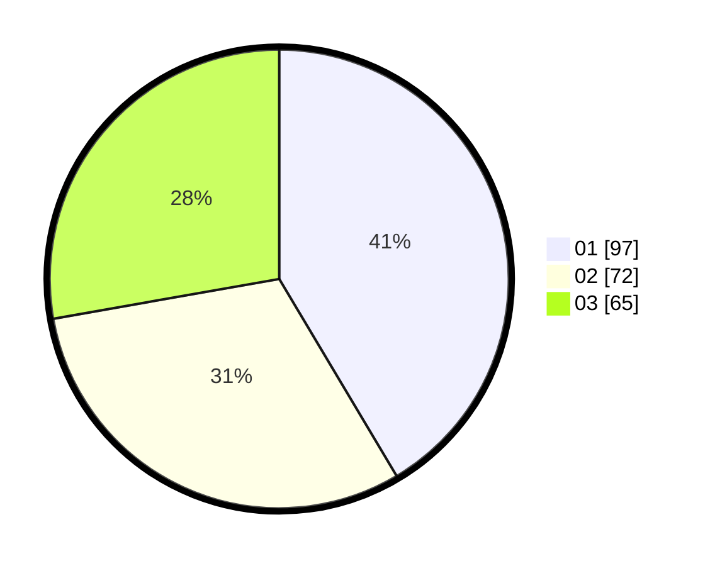

# Hasil

Hasil perolehan suara paslon dapat dilihat pada file paslon-01.txt, paslon-02.txt, dan paslon-03.txt.

Jika tidak ada, artinya data tersebut belum ada pada SIREKAP.

## Perolehan Suara

 * Paslon 01: **97**.
 * Paslon 02: **72**.
 * Paslon 03: **65**.

## Foto C Plano

https://sirekap-obj-formc.kpu.go.id/60f4/pemilu/ppwp/31/75/07/10/02/3175071002202-20240214-155110--6b475819-7dff-4312-9849-6caf68fcff58.jpg

https://sirekap-obj-formc.kpu.go.id/60f4/pemilu/ppwp/31/75/07/10/02/3175071002202-20240214-155157--ffc8477f-499b-4f0e-b192-fc725baa89ae.jpg

https://sirekap-obj-formc.kpu.go.id/60f4/pemilu/ppwp/31/75/07/10/02/3175071002202-20240214-155214--823e4367-f800-4592-bf67-8225af62bfe0.jpg

## DATA PEMILIH TETAP

Jumlah pemilih dalam DPT: **272**.
 * L: **133**.
 * P: **139**.

## DATA PENGGUNA HAK PILIH

Jumlah pengguna hak pilih dalam DPT: **231**.
 * L: **111**.
 * P: **120**.

Jumlah pengguna hak pilih dalam DPTb: **8**.
 * L: **2**.
 * P: **6**.

Jumlah pengguna hak pilih dalam DPK: **0**.
 * L: **0**.
 * P: **0**.

Jumlah pengguna hak pilih: **239**.
 * L: **113**.
 * P: **126**.

## JUMLAH SUARA SAH DAN TIDAK SAH

JUMLAH SELURUH SUARA SAH: **234**.

JUMLAH SUARA TIDAK SAH: **5**.

JUMLAH SELURUH SUARA SAH DAN SUARA TIDAK SAH: **239**.
