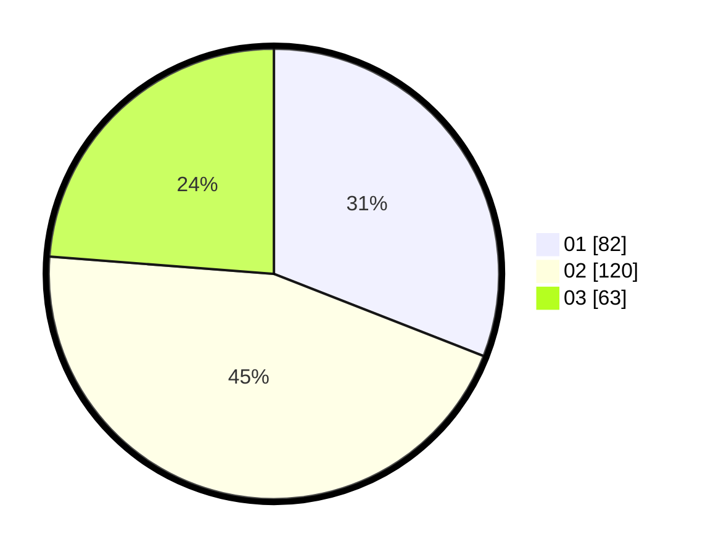

# Hasil

Hasil perolehan suara paslon dapat dilihat pada file paslon-01.txt, paslon-02.txt, dan paslon-03.txt.

Jika tidak ada, artinya data tersebut belum ada pada SIREKAP.

## Perolehan Suara

 * Paslon 01: **82**.
 * Paslon 02: **120**.
 * Paslon 03: **63**.

## Foto C Plano

https://sirekap-obj-formc.kpu.go.id/37cb/pemilu/ppwp/31/75/07/10/02/3175071002212-20240218-111338--a2ed6b69-20a1-450c-8d4a-e3ce277b5227.jpg

https://sirekap-obj-formc.kpu.go.id/37cb/pemilu/ppwp/31/75/07/10/02/3175071002212-20240215-041136--de56c22d-7530-4ab4-8a40-430d362aae69.jpg

https://sirekap-obj-formc.kpu.go.id/37cb/pemilu/ppwp/31/75/07/10/02/3175071002212-20240218-111440--87a9c9d6-948a-4880-ac2c-bf55c6652f71.jpg

## DATA PEMILIH TETAP

Jumlah pemilih dalam DPT: **294**.
 * L: **147**.
 * P: **147**.

## DATA PENGGUNA HAK PILIH

Jumlah pengguna hak pilih dalam DPT: **224**.
 * L: **100**.
 * P: **124**.

Jumlah pengguna hak pilih dalam DPTb: **22**.
 * L: **9**.
 * P: **13**.

Jumlah pengguna hak pilih dalam DPK: **21**.
 * L: **8**.
 * P: **13**.

Jumlah pengguna hak pilih: **267**.
 * L: **117**.
 * P: **150**.

## JUMLAH SUARA SAH DAN TIDAK SAH

JUMLAH SELURUH SUARA SAH: **265**.

JUMLAH SUARA TIDAK SAH: **2**.

JUMLAH SELURUH SUARA SAH DAN SUARA TIDAK SAH: **267**.
