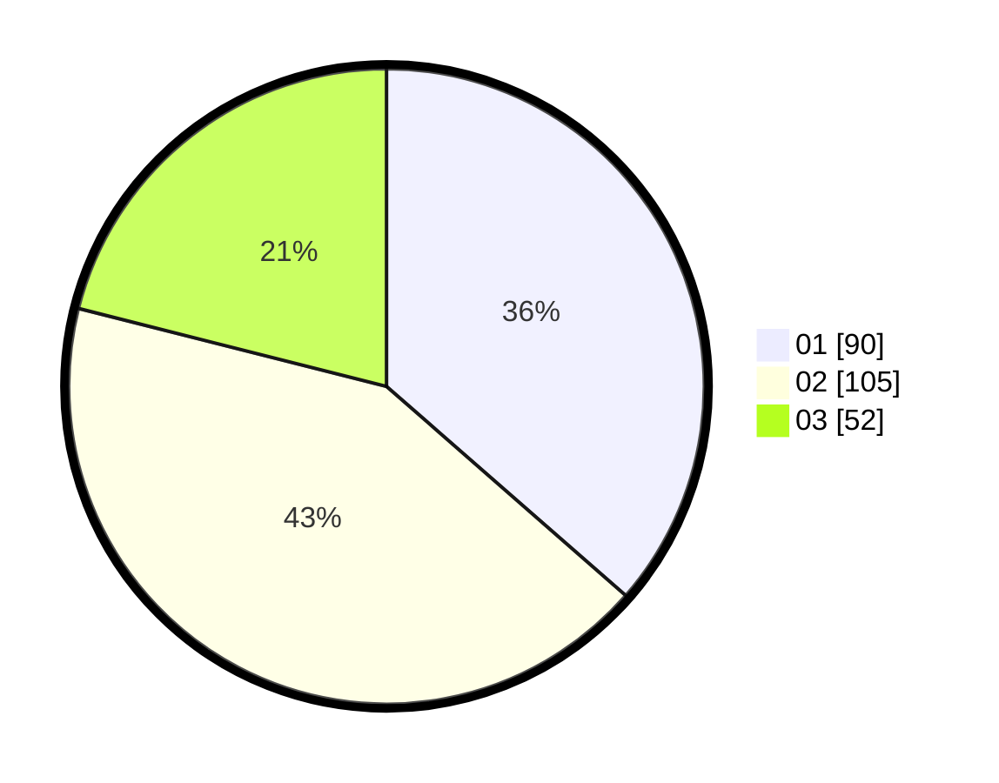

# Hasil

Hasil perolehan suara paslon dapat dilihat pada file paslon-01.txt, paslon-02.txt, dan paslon-03.txt.

Jika tidak ada, artinya data tersebut belum ada pada SIREKAP.

## Perolehan Suara

 * Paslon 01: **90**.
 * Paslon 02: **105**.
 * Paslon 03: **52**.

## Foto C Plano

https://sirekap-obj-formc.kpu.go.id/0a78/pemilu/ppwp/31/75/07/10/02/3175071002213-20240214-155447--9e60e78e-152d-45fc-ae1a-5a80fa855d70.jpg

https://sirekap-obj-formc.kpu.go.id/0a78/pemilu/ppwp/31/75/07/10/02/3175071002213-20240214-155605--2e66089d-df2a-471a-af00-de6640228ccf.jpg

https://sirekap-obj-formc.kpu.go.id/0a78/pemilu/ppwp/31/75/07/10/02/3175071002213-20240214-155632--c01df946-83cc-4b0e-b01c-6c0fd04cdb4e.jpg

## DATA PEMILIH TETAP

Jumlah pemilih dalam DPT: **294**.
 * L: **142**.
 * P: **152**.

## DATA PENGGUNA HAK PILIH

Jumlah pengguna hak pilih dalam DPT: **216**.
 * L: **99**.
 * P: **117**.

Jumlah pengguna hak pilih dalam DPTb: **23**.
 * L: **10**.
 * P: **13**.

Jumlah pengguna hak pilih dalam DPK: **8**.
 * L: **4**.
 * P: **4**.

Jumlah pengguna hak pilih: **247**.
 * L: **113**.
 * P: **134**.

## JUMLAH SUARA SAH DAN TIDAK SAH

JUMLAH SELURUH SUARA SAH: **247**.

JUMLAH SUARA TIDAK SAH: **0**.

JUMLAH SELURUH SUARA SAH DAN SUARA TIDAK SAH: **247**.
