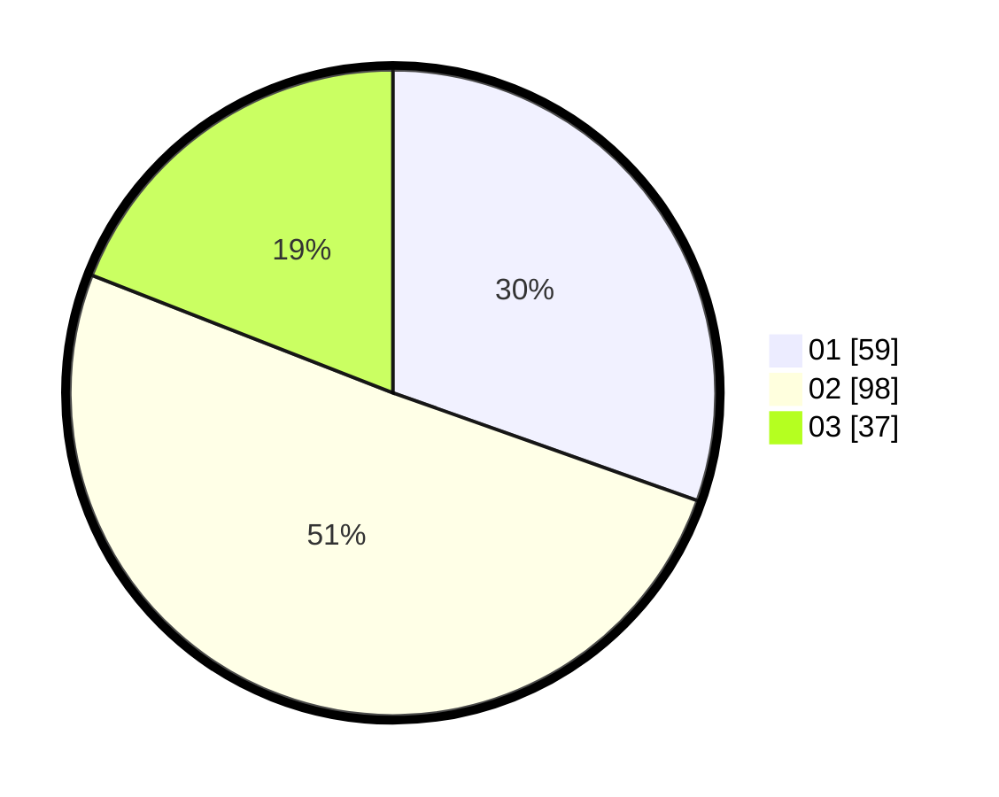

# Hasil

Hasil perolehan suara paslon dapat dilihat pada file paslon-01.txt, paslon-02.txt, dan paslon-03.txt.

Jika tidak ada, artinya data tersebut belum ada pada SIREKAP.

## Perolehan Suara

 * Paslon 01: **59**.
 * Paslon 02: **98**.
 * Paslon 03: **37**.

## Foto C Plano

https://sirekap-obj-formc.kpu.go.id/e1a2/pemilu/ppwp/31/75/07/10/03/3175071003002-20240216-061221--c4fa2377-aec3-47de-b15f-c51463ea9e09.jpg

https://sirekap-obj-formc.kpu.go.id/e1a2/pemilu/ppwp/31/75/07/10/03/3175071003002-20240216-061222--633ff7d6-2ee5-4c0b-98b0-388feb3838c0.jpg

https://sirekap-obj-formc.kpu.go.id/e1a2/pemilu/ppwp/31/75/07/10/03/3175071003002-20240216-061221--3ae6a4db-821b-4f7f-9c9f-520dade55ecc.jpg

## DATA PEMILIH TETAP

Jumlah pemilih dalam DPT: **269**.
 * L: **143**.
 * P: **126**.

## DATA PENGGUNA HAK PILIH

Jumlah pengguna hak pilih dalam DPT: **188**.
 * L: **94**.
 * P: **94**.

Jumlah pengguna hak pilih dalam DPTb: **1**.
 * L: **0**.
 * P: **1**.

Jumlah pengguna hak pilih dalam DPK: **7**.
 * L: **3**.
 * P: **4**.

Jumlah pengguna hak pilih: **196**.
 * L: **97**.
 * P: **99**.

## JUMLAH SUARA SAH DAN TIDAK SAH

JUMLAH SELURUH SUARA SAH: **194**.

JUMLAH SUARA TIDAK SAH: **2**.

JUMLAH SELURUH SUARA SAH DAN SUARA TIDAK SAH: **196**.
