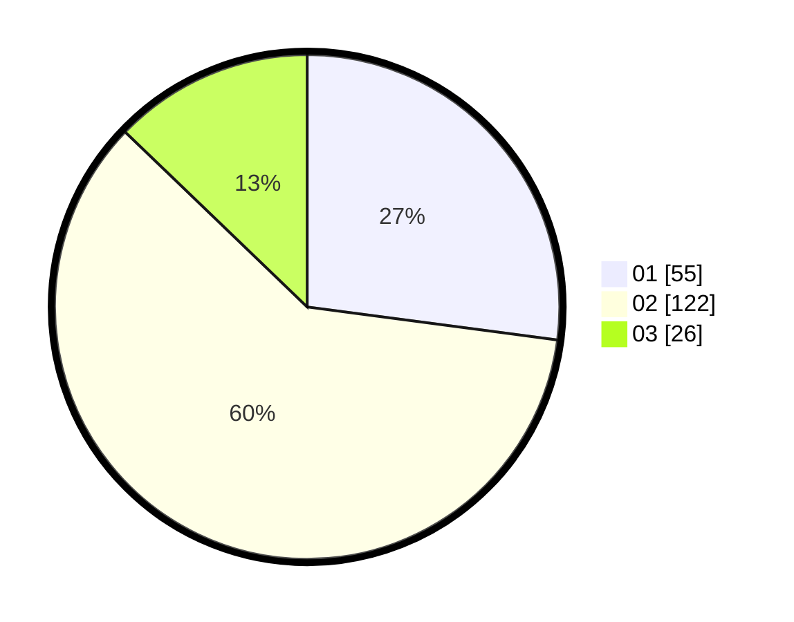

# Hasil

Hasil perolehan suara paslon dapat dilihat pada file paslon-01.txt, paslon-02.txt, dan paslon-03.txt.

Jika tidak ada, artinya data tersebut belum ada pada SIREKAP.

## Perolehan Suara

 * Paslon 01: **55**.
 * Paslon 02: **122**.
 * Paslon 03: **26**.

## Foto C Plano

https://sirekap-obj-formc.kpu.go.id/b0cd/pemilu/ppwp/31/75/07/10/03/3175071003006-20240216-140905--b60e2ad1-291e-402c-8a31-c93a0500b463.jpg

https://sirekap-obj-formc.kpu.go.id/b0cd/pemilu/ppwp/31/75/07/10/03/3175071003006-20240216-140906--0a5bf661-420d-49c7-b8e8-eead4268a0b9.jpg

https://sirekap-obj-formc.kpu.go.id/b0cd/pemilu/ppwp/31/75/07/10/03/3175071003006-20240216-140905--e61e306a-30fc-49f0-8401-0d416a57199d.jpg

## DATA PEMILIH TETAP

Jumlah pemilih dalam DPT: **272**.
 * L: **135**.
 * P: **137**.

## DATA PENGGUNA HAK PILIH

Jumlah pengguna hak pilih dalam DPT: **205**.
 * L: **105**.
 * P: **100**.

Jumlah pengguna hak pilih dalam DPTb: **1**.
 * L: **0**.
 * P: **1**.

Jumlah pengguna hak pilih dalam DPK: **1**.
 * L: **0**.
 * P: **1**.

Jumlah pengguna hak pilih: **207**.
 * L: **105**.
 * P: **102**.

## JUMLAH SUARA SAH DAN TIDAK SAH

JUMLAH SELURUH SUARA SAH: **203**.

JUMLAH SUARA TIDAK SAH: **4**.

JUMLAH SELURUH SUARA SAH DAN SUARA TIDAK SAH: **207**.
