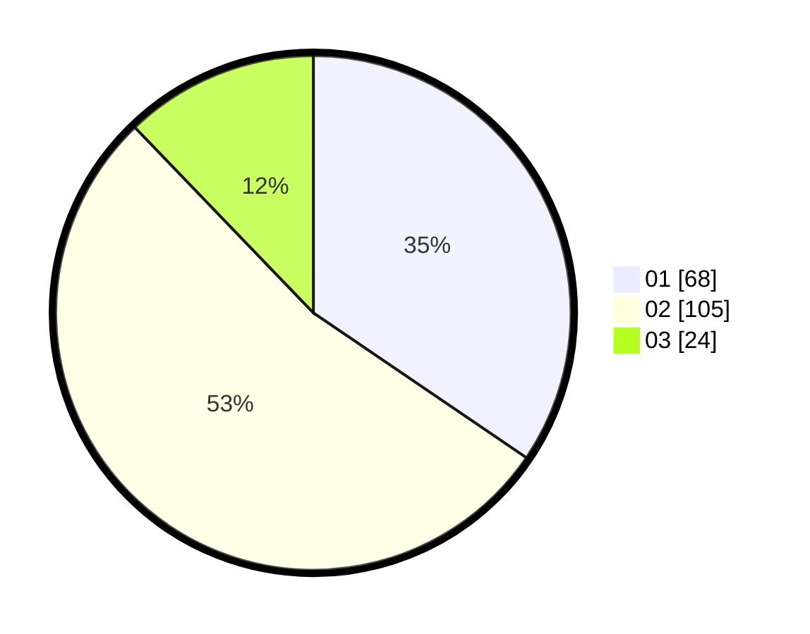

# Hasil

Hasil perolehan suara paslon dapat dilihat pada file paslon-01.txt, paslon-02.txt, dan paslon-03.txt.

Jika tidak ada, artinya data tersebut belum ada pada SIREKAP.

## Perolehan Suara

 * Paslon 01: **68**.
 * Paslon 02: **105**.
 * Paslon 03: **24**.

## Foto C Plano

https://sirekap-obj-formc.kpu.go.id/c24f/pemilu/ppwp/31/75/07/10/03/3175071003010-20240214-162241--c80ef996-c503-4dc1-8c48-23cbfaa847ea.jpg

https://sirekap-obj-formc.kpu.go.id/c24f/pemilu/ppwp/31/75/07/10/03/3175071003010-20240214-185732--a4e04404-569d-4884-8152-4ea374d1e6b2.jpg

https://sirekap-obj-formc.kpu.go.id/c24f/pemilu/ppwp/31/75/07/10/03/3175071003010-20240214-200159--26201aed-3df5-416d-8a75-5a35f2e8e0d3.jpg
