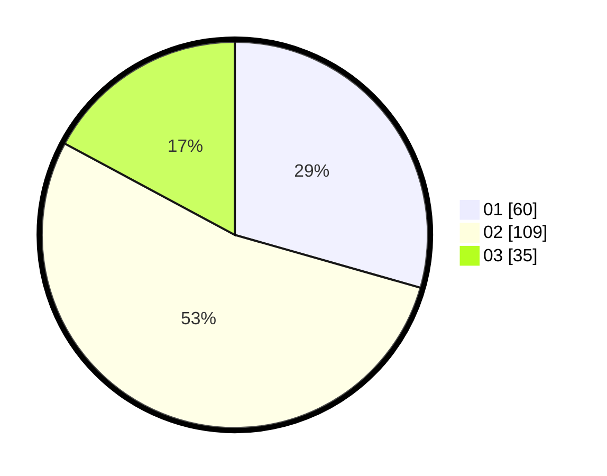

# Hasil

Hasil perolehan suara paslon dapat dilihat pada file paslon-01.txt, paslon-02.txt, dan paslon-03.txt.

Jika tidak ada, artinya data tersebut belum ada pada SIREKAP.

## Perolehan Suara

 * Paslon 01: **60**.
 * Paslon 02: **109**.
 * Paslon 03: **35**.

## Foto C Plano

https://sirekap-obj-formc.kpu.go.id/faa9/pemilu/ppwp/31/75/07/10/03/3175071003011-20240216-094730--0a1350f6-02b4-4ebe-9842-46e4986fe5e0.jpg

https://sirekap-obj-formc.kpu.go.id/faa9/pemilu/ppwp/31/75/07/10/03/3175071003011-20240214-232844--9f0db688-59f4-402c-8d55-85bc7aba6418.jpg

https://sirekap-obj-formc.kpu.go.id/faa9/pemilu/ppwp/31/75/07/10/03/3175071003011-20240214-232951--638441fe-8a25-4dec-9c7d-606022a158b2.jpg

## DATA PEMILIH TETAP

Jumlah pemilih dalam DPT: **276**.
 * L: **142**.
 * P: **134**.

## DATA PENGGUNA HAK PILIH

Jumlah pengguna hak pilih dalam DPT: **206**.
 * L: **109**.
 * P: **97**.

Jumlah pengguna hak pilih dalam DPTb: **1**.
 * L: **0**.
 * P: **1**.

Jumlah pengguna hak pilih dalam DPK: **0**.
 * L: **0**.
 * P: **0**.

Jumlah pengguna hak pilih: **207**.
 * L: **109**.
 * P: **98**.

## JUMLAH SUARA SAH DAN TIDAK SAH

JUMLAH SELURUH SUARA SAH: **204**.

JUMLAH SUARA TIDAK SAH: **3**.

JUMLAH SELURUH SUARA SAH DAN SUARA TIDAK SAH: **207**.
