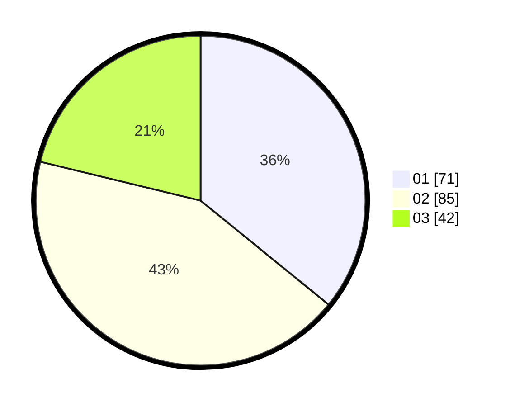

# Hasil

Hasil perolehan suara paslon dapat dilihat pada file paslon-01.txt, paslon-02.txt, dan paslon-03.txt.

Jika tidak ada, artinya data tersebut belum ada pada SIREKAP.

## Perolehan Suara

 * Paslon 01: **71**.
 * Paslon 02: **85**.
 * Paslon 03: **42**.

## Foto C Plano

https://sirekap-obj-formc.kpu.go.id/546a/pemilu/ppwp/31/75/07/10/03/3175071003021-20240215-013956--72756223-e0b3-4460-87a3-e3e28c494b0c.jpg

https://sirekap-obj-formc.kpu.go.id/546a/pemilu/ppwp/31/75/07/10/03/3175071003021-20240215-014143--1581a8d2-f28d-4b8b-ae03-c662464835b6.jpg

https://sirekap-obj-formc.kpu.go.id/546a/pemilu/ppwp/31/75/07/10/03/3175071003021-20240215-014236--c4a2fecd-5413-46b1-8858-15ca409f02a7.jpg
