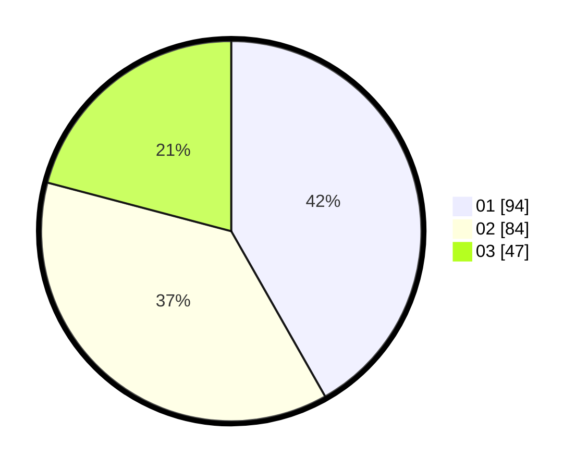

# Hasil

Hasil perolehan suara paslon dapat dilihat pada file paslon-01.txt, paslon-02.txt, dan paslon-03.txt.

Jika tidak ada, artinya data tersebut belum ada pada SIREKAP.

## Perolehan Suara

 * Paslon 01: **94**.
 * Paslon 02: **84**.
 * Paslon 03: **47**.

## Foto C Plano

https://sirekap-obj-formc.kpu.go.id/4f32/pemilu/ppwp/31/75/07/10/03/3175071003022-20240216-135506--f5ab726a-43f6-4612-9f5a-63d7503b278c.jpg

https://sirekap-obj-formc.kpu.go.id/4f32/pemilu/ppwp/31/75/07/10/03/3175071003022-20240216-135507--609b5795-ab75-4a96-9109-3111e14878cf.jpg

https://sirekap-obj-formc.kpu.go.id/4f32/pemilu/ppwp/31/75/07/10/03/3175071003022-20240216-135507--43530f3b-996b-406e-b02f-6ba862c8cdc8.jpg

## DATA PEMILIH TETAP

Jumlah pemilih dalam DPT: **270**.
 * L: **129**.
 * P: **141**.

## DATA PENGGUNA HAK PILIH

Jumlah pengguna hak pilih dalam DPT: **225**.
 * L: **104**.
 * P: **121**.

Jumlah pengguna hak pilih dalam DPTb: **0**.
 * L: **0**.
 * P: **0**.

Jumlah pengguna hak pilih dalam DPK: **4**.
 * L: **2**.
 * P: **2**.

Jumlah pengguna hak pilih: **229**.
 * L: **106**.
 * P: **123**.

## JUMLAH SUARA SAH DAN TIDAK SAH

JUMLAH SELURUH SUARA SAH: **225**.

JUMLAH SUARA TIDAK SAH: **4**.

JUMLAH SELURUH SUARA SAH DAN SUARA TIDAK SAH: **229**.
