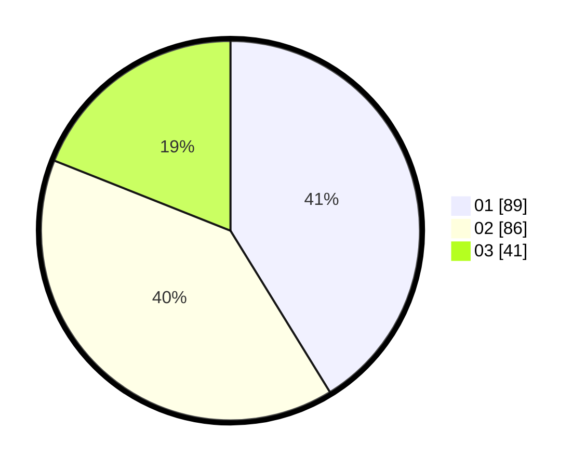

# Hasil

Hasil perolehan suara paslon dapat dilihat pada file paslon-01.txt, paslon-02.txt, dan paslon-03.txt.

Jika tidak ada, artinya data tersebut belum ada pada SIREKAP.

## Perolehan Suara

 * Paslon 01: **89**.
 * Paslon 02: **86**.
 * Paslon 03: **41**.

## Foto C Plano

https://sirekap-obj-formc.kpu.go.id/24ff/pemilu/ppwp/31/75/07/10/03/3175071003033-20240216-053400--64d8ed5a-060a-48e2-8e41-7eb1754e310c.jpg

https://sirekap-obj-formc.kpu.go.id/24ff/pemilu/ppwp/31/75/07/10/03/3175071003033-20240216-053402--5e92d1a3-b605-4602-9bdd-7898248410a4.jpg

https://sirekap-obj-formc.kpu.go.id/24ff/pemilu/ppwp/31/75/07/10/03/3175071003033-20240216-053401--3ba49a1b-f298-4550-8449-2c3b0d864e1d.jpg

## DATA PEMILIH TETAP

Jumlah pemilih dalam DPT: **0**.
 * L: **0**.
 * P: **0**.

## DATA PENGGUNA HAK PILIH

Jumlah pengguna hak pilih dalam DPT: **0**.
 * L: **0**.
 * P: **0**.

Jumlah pengguna hak pilih dalam DPTb: **0**.
 * L: **0**.
 * P: **0**.

Jumlah pengguna hak pilih dalam DPK: **0**.
 * L: **0**.
 * P: **0**.

Jumlah pengguna hak pilih: **0**.
 * L: **0**.
 * P: **0**.

## JUMLAH SUARA SAH DAN TIDAK SAH

JUMLAH SELURUH SUARA SAH: **216**.

JUMLAH SUARA TIDAK SAH: **0**.

JUMLAH SELURUH SUARA SAH DAN SUARA TIDAK SAH: **216**.
