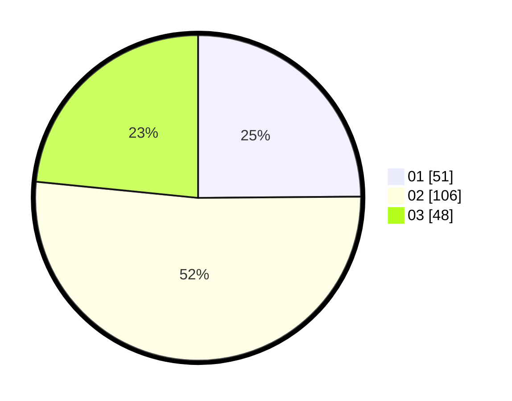

# Hasil

Hasil perolehan suara paslon dapat dilihat pada file paslon-01.txt, paslon-02.txt, dan paslon-03.txt.

Jika tidak ada, artinya data tersebut belum ada pada SIREKAP.

## Perolehan Suara

 * Paslon 01: **51**.
 * Paslon 02: **106**.
 * Paslon 03: **48**.

## Foto C Plano

https://sirekap-obj-formc.kpu.go.id/03f0/pemilu/ppwp/31/75/07/10/03/3175071003037-20240215-035049--aa8509e2-9646-4cc0-a606-deb5edac8913.jpg

https://sirekap-obj-formc.kpu.go.id/03f0/pemilu/ppwp/31/75/07/10/03/3175071003037-20240215-035201--d980c817-4abd-4f27-8e3f-98b4f1302b2d.jpg

https://sirekap-obj-formc.kpu.go.id/03f0/pemilu/ppwp/31/75/07/10/03/3175071003037-20240215-035233--feb3a709-2a2c-4a80-a719-a17c334d5634.jpg
