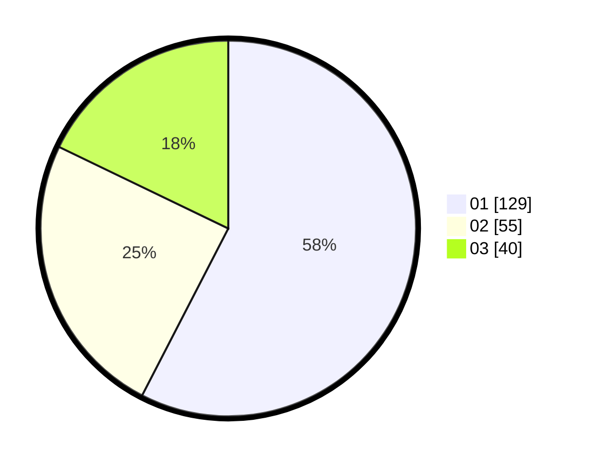

# Hasil

Hasil perolehan suara paslon dapat dilihat pada file paslon-01.txt, paslon-02.txt, dan paslon-03.txt.

Jika tidak ada, artinya data tersebut belum ada pada SIREKAP.

## Perolehan Suara

 * Paslon 01: **129**.
 * Paslon 02: **55**.
 * Paslon 03: **40**.

## Foto C Plano

https://sirekap-obj-formc.kpu.go.id/7bec/pemilu/ppwp/31/75/07/10/03/3175071003040-20240216-004618--2cb261a0-aabc-4b4e-b804-d5b2ef87df2e.jpg

https://sirekap-obj-formc.kpu.go.id/7bec/pemilu/ppwp/31/75/07/10/03/3175071003040-20240216-004630--f3877b19-818d-48a0-8a71-866c8d15ec81.jpg

https://sirekap-obj-formc.kpu.go.id/7bec/pemilu/ppwp/31/75/07/10/03/3175071003040-20240216-004624--1270855c-6f29-4f68-99ec-00b6dace7642.jpg

## DATA PEMILIH TETAP

Jumlah pemilih dalam DPT: **272**.
 * L: **140**.
 * P: **132**.

## DATA PENGGUNA HAK PILIH

Jumlah pengguna hak pilih dalam DPT: **223**.
 * L: **112**.
 * P: **111**.

Jumlah pengguna hak pilih dalam DPTb: **2**.
 * L: **0**.
 * P: **2**.

Jumlah pengguna hak pilih dalam DPK: **4**.
 * L: **2**.
 * P: **2**.

Jumlah pengguna hak pilih: **229**.
 * L: **114**.
 * P: **115**.

## JUMLAH SUARA SAH DAN TIDAK SAH

JUMLAH SELURUH SUARA SAH: **224**.

JUMLAH SUARA TIDAK SAH: **5**.

JUMLAH SELURUH SUARA SAH DAN SUARA TIDAK SAH: **229**.
