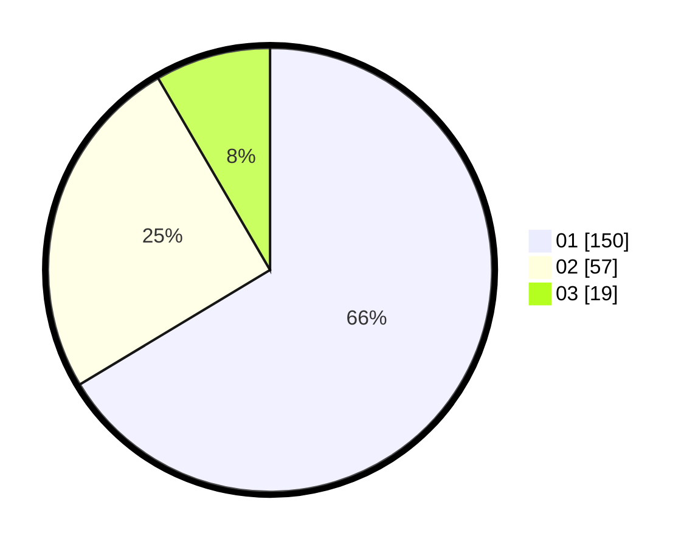

# Hasil

Hasil perolehan suara paslon dapat dilihat pada file paslon-01.txt, paslon-02.txt, dan paslon-03.txt.

Jika tidak ada, artinya data tersebut belum ada pada SIREKAP.

## Perolehan Suara

 * Paslon 01: **150**.
 * Paslon 02: **57**.
 * Paslon 03: **19**.

## Foto C Plano

https://sirekap-obj-formc.kpu.go.id/6a9d/pemilu/ppwp/31/75/07/10/03/3175071003042-20240215-000437--3b351b7f-fa4a-4b2f-bc2d-f53630b242db.jpg

https://sirekap-obj-formc.kpu.go.id/6a9d/pemilu/ppwp/31/75/07/10/03/3175071003042-20240214-175303--9883f79b-80a3-4b0c-a54b-97a8b94fdd36.jpg

https://sirekap-obj-formc.kpu.go.id/6a9d/pemilu/ppwp/31/75/07/10/03/3175071003042-20240215-003624--b5252b53-bd03-43cb-b181-046ce56be25a.jpg
