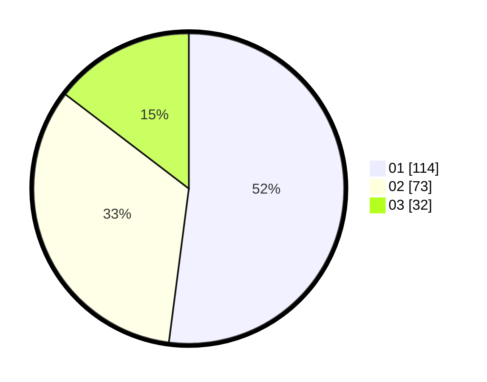

# Hasil

Hasil perolehan suara paslon dapat dilihat pada file paslon-01.txt, paslon-02.txt, dan paslon-03.txt.

Jika tidak ada, artinya data tersebut belum ada pada SIREKAP.

## Perolehan Suara

 * Paslon 01: **114**.
 * Paslon 02: **73**.
 * Paslon 03: **32**.

## Foto C Plano

https://sirekap-obj-formc.kpu.go.id/887d/pemilu/ppwp/31/75/07/10/03/3175071003043-20240214-155041--dc525a98-99e9-4186-bd72-4d3eb97cd12d.jpg

https://sirekap-obj-formc.kpu.go.id/887d/pemilu/ppwp/31/75/07/10/03/3175071003043-20240214-155045--c01109f0-89d4-400d-b7f4-852a8c9ecd5e.jpg

https://sirekap-obj-formc.kpu.go.id/887d/pemilu/ppwp/31/75/07/10/03/3175071003043-20240214-155050--a896a518-d6c1-455e-86e3-cd484e0bdaca.jpg
