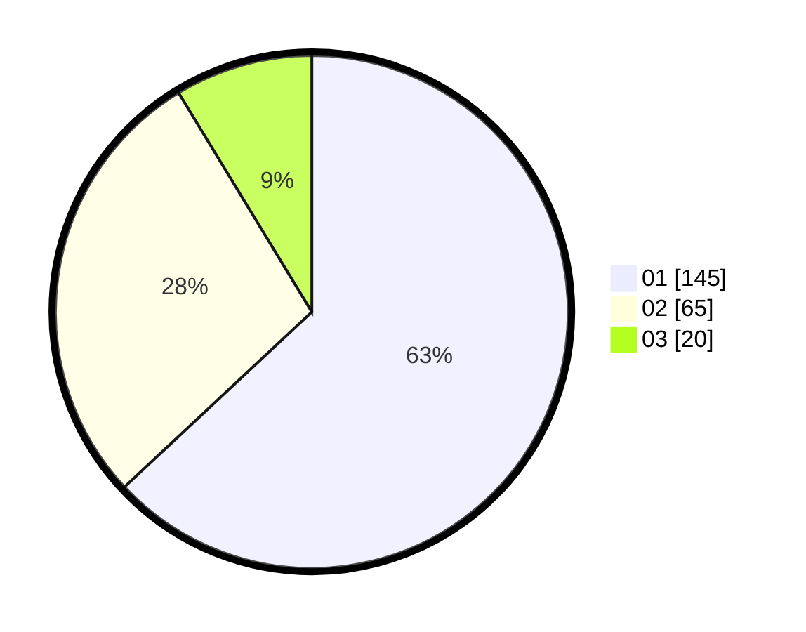

# Hasil

Hasil perolehan suara paslon dapat dilihat pada file paslon-01.txt, paslon-02.txt, dan paslon-03.txt.

Jika tidak ada, artinya data tersebut belum ada pada SIREKAP.

## Perolehan Suara

 * Paslon 01: **145**.
 * Paslon 02: **65**.
 * Paslon 03: **20**.

## Foto C Plano

https://sirekap-obj-formc.kpu.go.id/1466/pemilu/ppwp/31/75/07/10/03/3175071003044-20240215-033720--00472bbb-e87c-4be9-b404-f2ce7e719161.jpg

https://sirekap-obj-formc.kpu.go.id/1466/pemilu/ppwp/31/75/07/10/03/3175071003044-20240215-010335--3140ebd2-50d2-43e5-a0dd-0e35785002e4.jpg

https://sirekap-obj-formc.kpu.go.id/1466/pemilu/ppwp/31/75/07/10/03/3175071003044-20240215-010602--d002d7d0-f112-4c85-a18c-8c38d234e88c.jpg

## DATA PEMILIH TETAP

Jumlah pemilih dalam DPT: **273**.
 * L: **130**.
 * P: **143**.

## DATA PENGGUNA HAK PILIH

Jumlah pengguna hak pilih dalam DPT: **231**.
 * L: **107**.
 * P: **124**.

Jumlah pengguna hak pilih dalam DPTb: **1**.
 * L: **0**.
 * P: **1**.

Jumlah pengguna hak pilih dalam DPK: **0**.
 * L: **0**.
 * P: **0**.

Jumlah pengguna hak pilih: **232**.
 * L: **107**.
 * P: **125**.

## JUMLAH SUARA SAH DAN TIDAK SAH

JUMLAH SELURUH SUARA SAH: **230**.

JUMLAH SUARA TIDAK SAH: **2**.

JUMLAH SELURUH SUARA SAH DAN SUARA TIDAK SAH: **232**.
