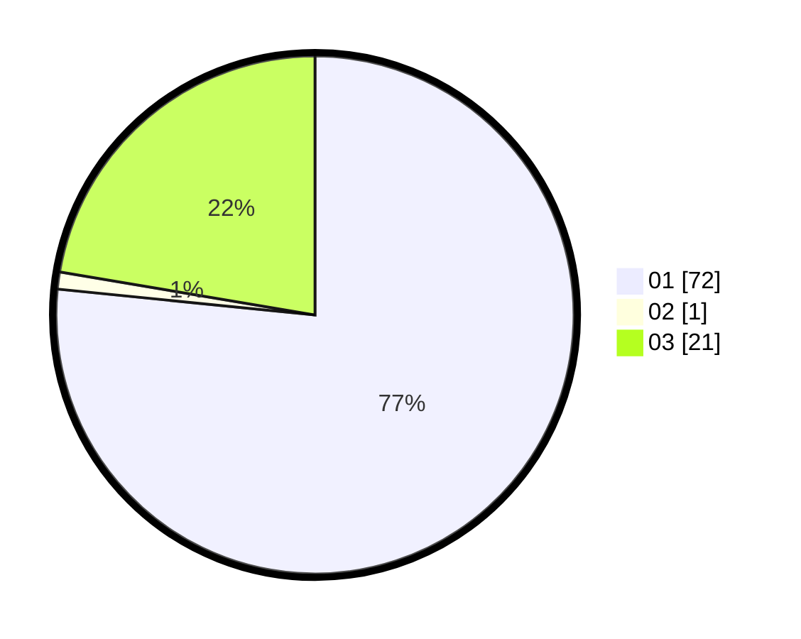

# Hasil

Hasil perolehan suara paslon dapat dilihat pada file paslon-01.txt, paslon-02.txt, dan paslon-03.txt.

Jika tidak ada, artinya data tersebut belum ada pada SIREKAP.

## Perolehan Suara

 * Paslon 01: **72**.
 * Paslon 02: **1**.
 * Paslon 03: **21**.

## Foto C Plano

https://sirekap-obj-formc.kpu.go.id/6ce7/pemilu/ppwp/31/75/07/10/03/3175071003050-20240214-191940--a743e2f2-1679-48ad-a206-c6422b6700bc.jpg

https://sirekap-obj-formc.kpu.go.id/6ce7/pemilu/ppwp/31/75/07/10/03/3175071003050-20240214-191820--171c0c8b-574e-4984-a124-2ad019ee5987.jpg

https://sirekap-obj-formc.kpu.go.id/6ce7/pemilu/ppwp/31/75/07/10/03/3175071003050-20240214-192050--bc90b889-6e37-499a-9a79-e0e664dcc9f9.jpg

## DATA PEMILIH TETAP

Jumlah pemilih dalam DPT: **271**.
 * L: **134**.
 * P: **137**.

## DATA PENGGUNA HAK PILIH

Jumlah pengguna hak pilih dalam DPT: **188**.
 * L: **91**.
 * P: **97**.

Jumlah pengguna hak pilih dalam DPTb: **5**.
 * L: **4**.
 * P: **1**.

Jumlah pengguna hak pilih dalam DPK: **1**.
 * L: **1**.
 * P: **0**.

Jumlah pengguna hak pilih: **194**.
 * L: **96**.
 * P: **98**.

## JUMLAH SUARA SAH DAN TIDAK SAH

JUMLAH SELURUH SUARA SAH: **193**.

JUMLAH SUARA TIDAK SAH: **1**.

JUMLAH SELURUH SUARA SAH DAN SUARA TIDAK SAH: **194**.
