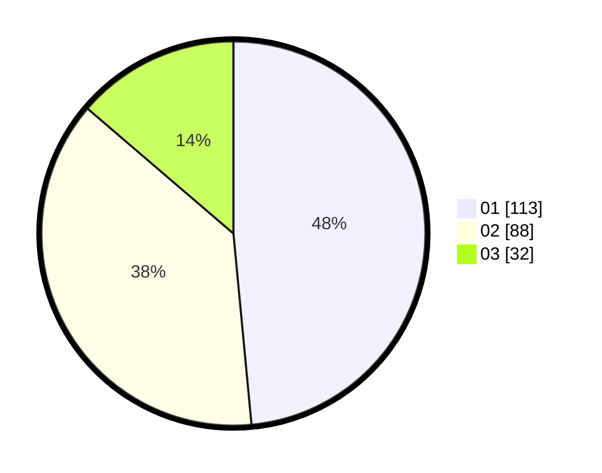

# Hasil

Hasil perolehan suara paslon dapat dilihat pada file paslon-01.txt, paslon-02.txt, dan paslon-03.txt.

Jika tidak ada, artinya data tersebut belum ada pada SIREKAP.

## Perolehan Suara

 * Paslon 01: **113**.
 * Paslon 02: **88**.
 * Paslon 03: **32**.

## Foto C Plano

https://sirekap-obj-formc.kpu.go.id/1cd9/pemilu/ppwp/31/75/07/10/03/3175071003054-20240215-015808--0678bf57-5167-4390-b874-d4e051a86fbb.jpg

https://sirekap-obj-formc.kpu.go.id/1cd9/pemilu/ppwp/31/75/07/10/03/3175071003054-20240215-015911--4cd64d9a-a38e-42f1-9d65-bf37734ec605.jpg

https://sirekap-obj-formc.kpu.go.id/1cd9/pemilu/ppwp/31/75/07/10/03/3175071003054-20240215-015956--6a96bd96-928c-4aed-92d0-ce87b29286c4.jpg

## DATA PEMILIH TETAP

Jumlah pemilih dalam DPT: **272**.
 * L: **122**.
 * P: **150**.

## DATA PENGGUNA HAK PILIH

Jumlah pengguna hak pilih dalam DPT: **236**.
 * L: **554**.
 * P: **132**.

Jumlah pengguna hak pilih dalam DPTb: **1**.
 * L: **0**.
 * P: **1**.

Jumlah pengguna hak pilih dalam DPK: **4**.
 * L: **2**.
 * P: **2**.

Jumlah pengguna hak pilih: **247**.
 * L: **706**.
 * P: **135**.

## JUMLAH SUARA SAH DAN TIDAK SAH

JUMLAH SELURUH SUARA SAH: **233**.

JUMLAH SUARA TIDAK SAH: **8**.

JUMLAH SELURUH SUARA SAH DAN SUARA TIDAK SAH: **244**.
