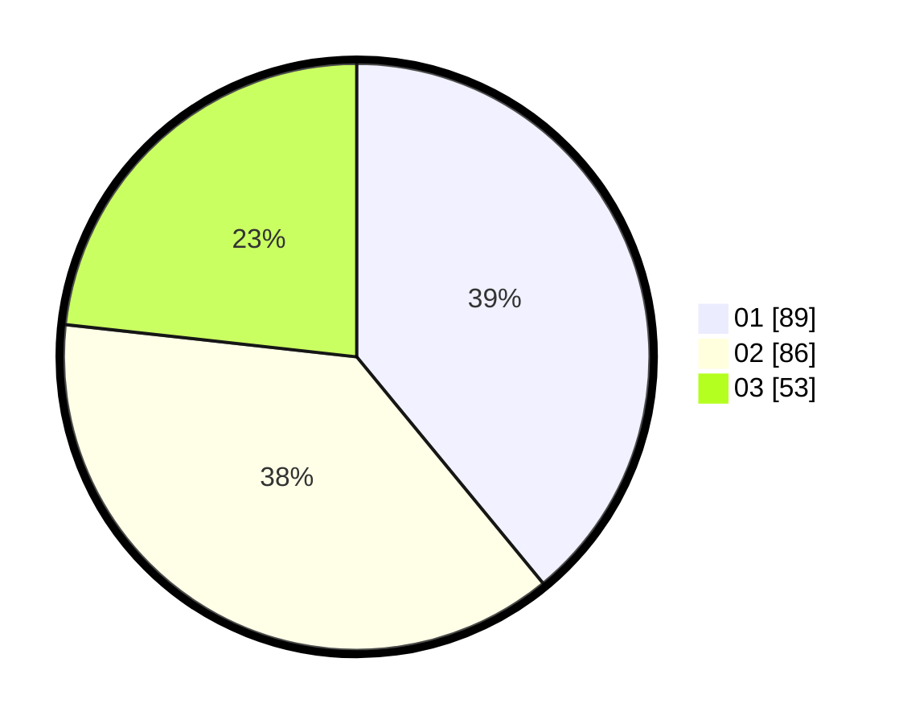

# Hasil

Hasil perolehan suara paslon dapat dilihat pada file paslon-01.txt, paslon-02.txt, dan paslon-03.txt.

Jika tidak ada, artinya data tersebut belum ada pada SIREKAP.

## Perolehan Suara

 * Paslon 01: **89**.
 * Paslon 02: **86**.
 * Paslon 03: **53**.

## Foto C Plano

https://sirekap-obj-formc.kpu.go.id/4b67/pemilu/ppwp/31/75/07/10/03/3175071003059-20240216-143319--6b8b32d5-43a0-49d4-a962-4e5a4054ab2e.jpg

https://sirekap-obj-formc.kpu.go.id/4b67/pemilu/ppwp/31/75/07/10/03/3175071003059-20240216-143320--47b2ee52-c521-4ace-950a-2df2cbed4b0d.jpg

https://sirekap-obj-formc.kpu.go.id/4b67/pemilu/ppwp/31/75/07/10/03/3175071003059-20240216-143320--f1814af3-5cca-4dc3-ab77-63a1e05937b4.jpg

## DATA PEMILIH TETAP

Jumlah pemilih dalam DPT: **264**.
 * L: **135**.
 * P: **129**.

## DATA PENGGUNA HAK PILIH

Jumlah pengguna hak pilih dalam DPT: **228**.
 * L: **113**.
 * P: **115**.

Jumlah pengguna hak pilih dalam DPTb: **2**.
 * L: **1**.
 * P: **1**.

Jumlah pengguna hak pilih dalam DPK: **0**.
 * L: **0**.
 * P: **0**.

Jumlah pengguna hak pilih: **230**.
 * L: **114**.
 * P: **116**.

## JUMLAH SUARA SAH DAN TIDAK SAH

JUMLAH SELURUH SUARA SAH: **228**.

JUMLAH SUARA TIDAK SAH: **2**.

JUMLAH SELURUH SUARA SAH DAN SUARA TIDAK SAH: **230**.
