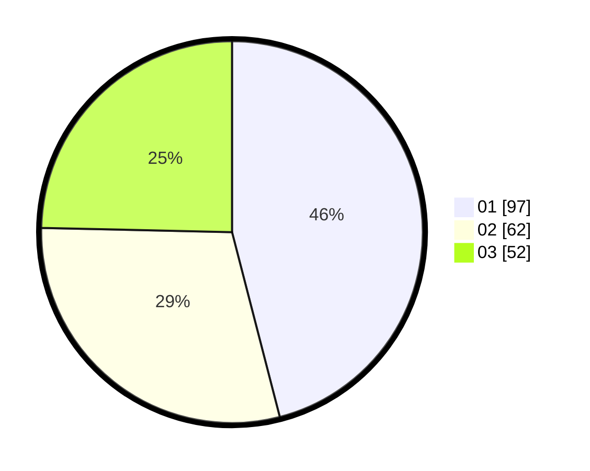

# Hasil

Hasil perolehan suara paslon dapat dilihat pada file paslon-01.txt, paslon-02.txt, dan paslon-03.txt.

Jika tidak ada, artinya data tersebut belum ada pada SIREKAP.

## Perolehan Suara

 * Paslon 01: **97**.
 * Paslon 02: **62**.
 * Paslon 03: **52**.

## Foto C Plano

https://sirekap-obj-formc.kpu.go.id/d8ae/pemilu/ppwp/31/75/07/10/03/3175071003060-20240215-230846--6a81248f-52e3-4d4e-82af-2cba371a9ad2.jpg

https://sirekap-obj-formc.kpu.go.id/d8ae/pemilu/ppwp/31/75/07/10/03/3175071003060-20240215-230852--18d9cc05-8c34-420d-9f0b-e28604fdea6d.jpg

https://sirekap-obj-formc.kpu.go.id/d8ae/pemilu/ppwp/31/75/07/10/03/3175071003060-20240215-230850--268da29a-0f58-4908-a09c-b1179f9e2681.jpg

## DATA PEMILIH TETAP

Jumlah pemilih dalam DPT: **262**.
 * L: **122**.
 * P: **140**.

## DATA PENGGUNA HAK PILIH

Jumlah pengguna hak pilih dalam DPT: **211**.
 * L: **92**.
 * P: **119**.

Jumlah pengguna hak pilih dalam DPTb: **0**.
 * L: **0**.
 * P: **0**.

Jumlah pengguna hak pilih dalam DPK: **1**.
 * L: **1**.
 * P: **0**.

Jumlah pengguna hak pilih: **212**.
 * L: **93**.
 * P: **119**.

## JUMLAH SUARA SAH DAN TIDAK SAH

JUMLAH SELURUH SUARA SAH: **211**.

JUMLAH SUARA TIDAK SAH: **4**.

JUMLAH SELURUH SUARA SAH DAN SUARA TIDAK SAH: **215**.
