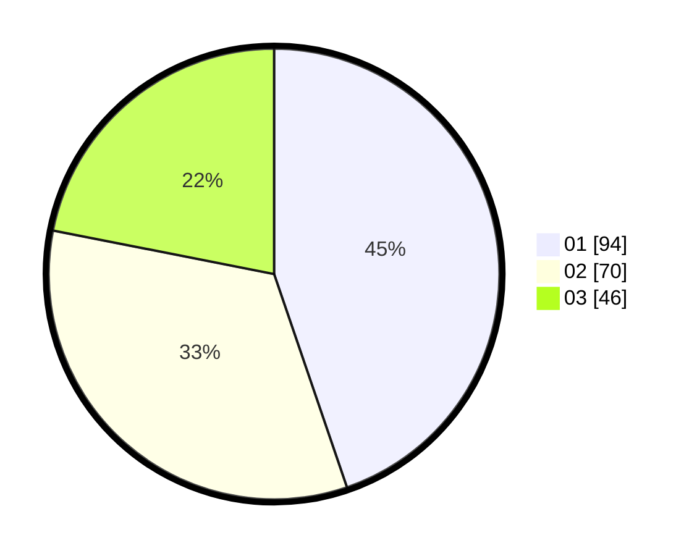

# Hasil

Hasil perolehan suara paslon dapat dilihat pada file paslon-01.txt, paslon-02.txt, dan paslon-03.txt.

Jika tidak ada, artinya data tersebut belum ada pada SIREKAP.

## Perolehan Suara

 * Paslon 01: **94**.
 * Paslon 02: **70**.
 * Paslon 03: **46**.

## Foto C Plano

https://sirekap-obj-formc.kpu.go.id/73b4/pemilu/ppwp/31/75/07/10/03/3175071003061-20240216-140324--9b937589-11d8-400e-afd0-73e423fad7a6.jpg

https://sirekap-obj-formc.kpu.go.id/73b4/pemilu/ppwp/31/75/07/10/03/3175071003061-20240216-140325--dbce525d-d0f7-4180-956d-d8fa57cf37d3.jpg

https://sirekap-obj-formc.kpu.go.id/73b4/pemilu/ppwp/31/75/07/10/03/3175071003061-20240216-140324--6d1437ed-b9b3-4f8d-a91e-a50df79bfc33.jpg

## DATA PEMILIH TETAP

Jumlah pemilih dalam DPT: **260**.
 * L: **126**.
 * P: **134**.

## DATA PENGGUNA HAK PILIH

Jumlah pengguna hak pilih dalam DPT: **214**.
 * L: **92**.
 * P: **122**.

Jumlah pengguna hak pilih dalam DPTb: **0**.
 * L: **0**.
 * P: **0**.

Jumlah pengguna hak pilih dalam DPK: **2**.
 * L: **2**.
 * P: **0**.

Jumlah pengguna hak pilih: **216**.
 * L: **94**.
 * P: **122**.

## JUMLAH SUARA SAH DAN TIDAK SAH

JUMLAH SELURUH SUARA SAH: **210**.

JUMLAH SUARA TIDAK SAH: **6**.

JUMLAH SELURUH SUARA SAH DAN SUARA TIDAK SAH: **216**.
