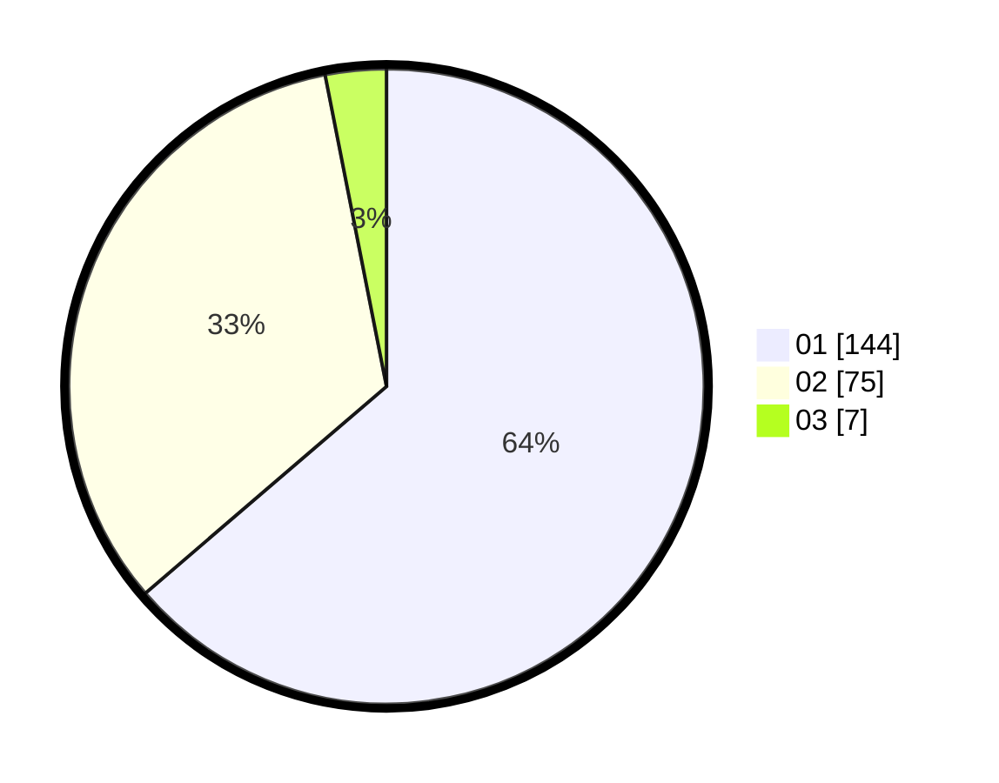

# Hasil

Hasil perolehan suara paslon dapat dilihat pada file paslon-01.txt, paslon-02.txt, dan paslon-03.txt.

Jika tidak ada, artinya data tersebut belum ada pada SIREKAP.

## Perolehan Suara

 * Paslon 01: **144**.
 * Paslon 02: **75**.
 * Paslon 03: **7**.

## Foto C Plano

https://sirekap-obj-formc.kpu.go.id/2ae4/pemilu/ppwp/31/75/07/10/03/3175071003064-20240214-205606--fa9247a8-d53f-4743-b71a-9bac4ebf0aef.jpg

https://sirekap-obj-formc.kpu.go.id/2ae4/pemilu/ppwp/31/75/07/10/03/3175071003064-20240214-205639--4da4589b-a29a-4960-9b98-32d16df887f7.jpg

https://sirekap-obj-formc.kpu.go.id/2ae4/pemilu/ppwp/31/75/07/10/03/3175071003064-20240214-155355--86d3f688-37fa-4b0c-a1c2-6c0c887eb5f1.jpg
