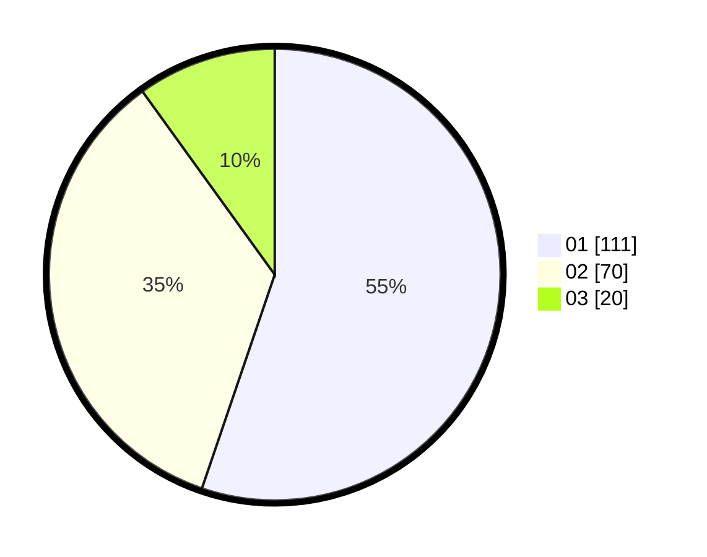

# Hasil

Hasil perolehan suara paslon dapat dilihat pada file paslon-01.txt, paslon-02.txt, dan paslon-03.txt.

Jika tidak ada, artinya data tersebut belum ada pada SIREKAP.

## Perolehan Suara

 * Paslon 01: **111**.
 * Paslon 02: **70**.
 * Paslon 03: **20**.

## Foto C Plano

https://sirekap-obj-formc.kpu.go.id/a813/pemilu/ppwp/31/75/07/10/03/3175071003066-20240214-191722--5eaf2173-b5e7-4592-ba48-60dd603c19b4.jpg

https://sirekap-obj-formc.kpu.go.id/a813/pemilu/ppwp/31/75/07/10/03/3175071003066-20240214-192658--ec19af34-9f6a-4c5d-b9f8-885805cded3b.jpg

https://sirekap-obj-formc.kpu.go.id/a813/pemilu/ppwp/31/75/07/10/03/3175071003066-20240214-192014--e8b4c011-515e-4834-b73b-cb7cc5d12f29.jpg

## DATA PEMILIH TETAP

Jumlah pemilih dalam DPT: **261**.
 * L: **130**.
 * P: **131**.

## DATA PENGGUNA HAK PILIH

Jumlah pengguna hak pilih dalam DPT: **261**.
 * L: **130**.
 * P: **131**.

Jumlah pengguna hak pilih dalam DPTb: **0**.
 * L: **0**.
 * P: **0**.

Jumlah pengguna hak pilih dalam DPK: **0**.
 * L: **0**.
 * P: **0**.

Jumlah pengguna hak pilih: **261**.
 * L: **130**.
 * P: **131**.

## JUMLAH SUARA SAH DAN TIDAK SAH

JUMLAH SELURUH SUARA SAH: **201**.

JUMLAH SUARA TIDAK SAH: **0**.

JUMLAH SELURUH SUARA SAH DAN SUARA TIDAK SAH: **201**.
