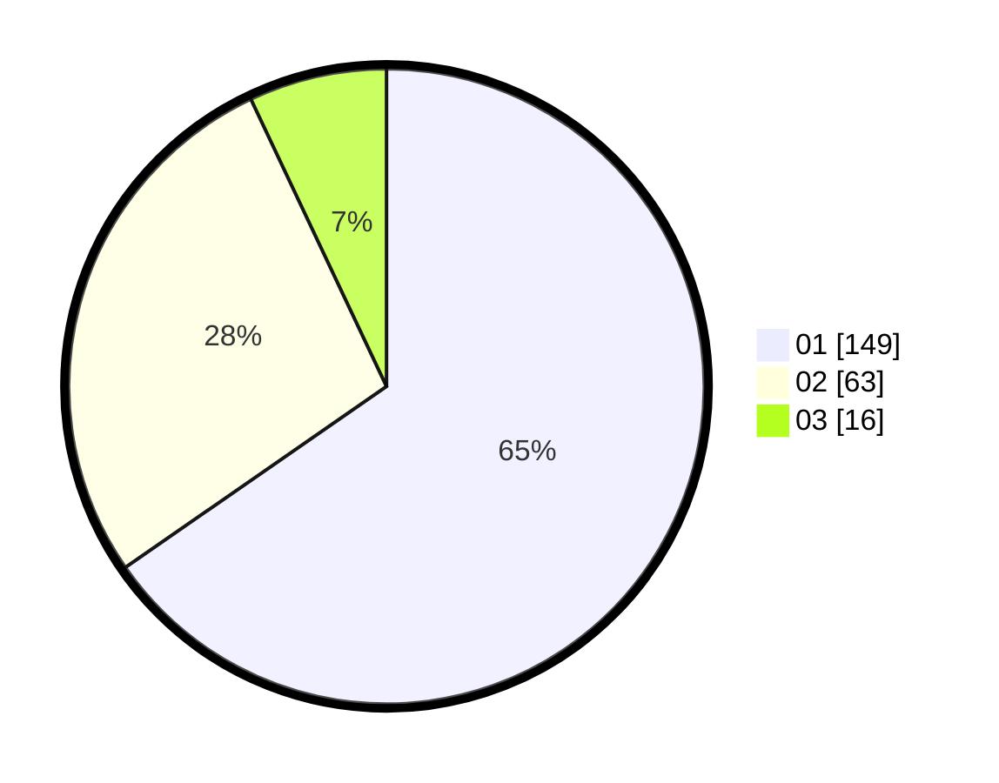

# Hasil

Hasil perolehan suara paslon dapat dilihat pada file paslon-01.txt, paslon-02.txt, dan paslon-03.txt.

Jika tidak ada, artinya data tersebut belum ada pada SIREKAP.

## Perolehan Suara

 * Paslon 01: **149**.
 * Paslon 02: **63**.
 * Paslon 03: **16**.

## Foto C Plano

https://sirekap-obj-formc.kpu.go.id/9ccf/pemilu/ppwp/31/75/07/10/03/3175071003067-20240216-182746--8bce125d-cdd3-4724-bc46-c52f1aafd643.jpg

https://sirekap-obj-formc.kpu.go.id/9ccf/pemilu/ppwp/31/75/07/10/03/3175071003067-20240216-182747--a10b09eb-b2d7-4ccd-a920-fbff5e07c652.jpg

https://sirekap-obj-formc.kpu.go.id/9ccf/pemilu/ppwp/31/75/07/10/03/3175071003067-20240216-182746--efd7c57f-ac1f-48b6-89f1-b0131fd3587f.jpg

## DATA PEMILIH TETAP

Jumlah pemilih dalam DPT: **271**.
 * L: **136**.
 * P: **135**.

## DATA PENGGUNA HAK PILIH

Jumlah pengguna hak pilih dalam DPT: **228**.
 * L: **111**.
 * P: **117**.

Jumlah pengguna hak pilih dalam DPTb: **1**.
 * L: **1**.
 * P: **0**.

Jumlah pengguna hak pilih dalam DPK: **1**.
 * L: **0**.
 * P: **1**.

Jumlah pengguna hak pilih: **230**.
 * L: **112**.
 * P: **118**.

## JUMLAH SUARA SAH DAN TIDAK SAH

JUMLAH SELURUH SUARA SAH: **228**.

JUMLAH SUARA TIDAK SAH: **2**.

JUMLAH SELURUH SUARA SAH DAN SUARA TIDAK SAH: **230**.
