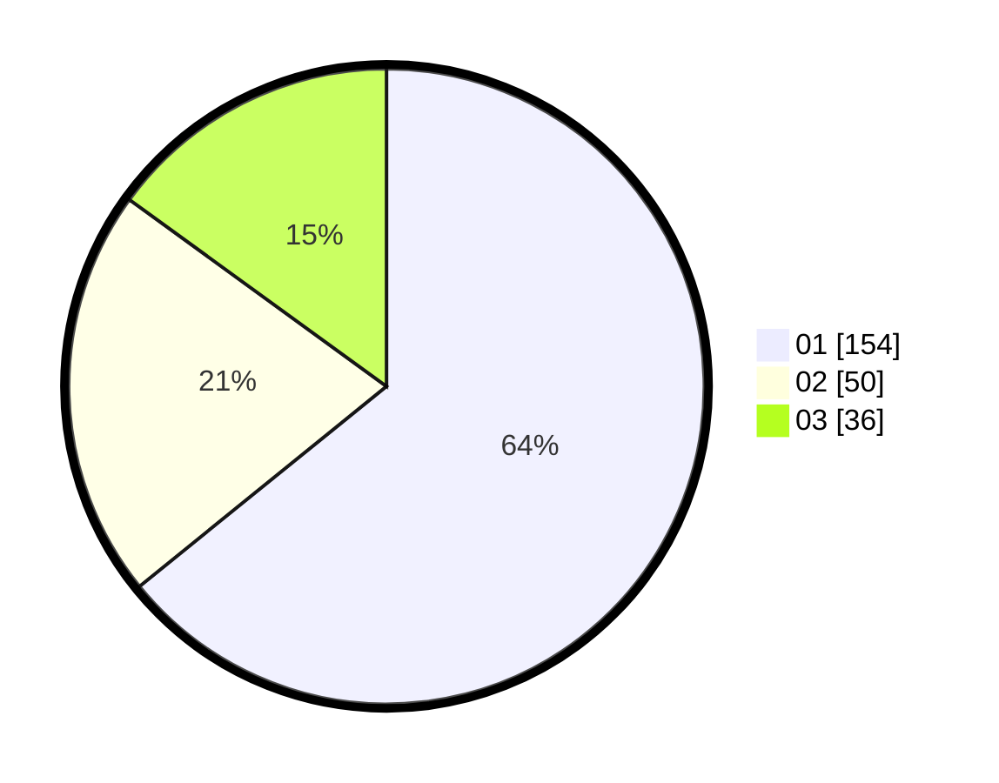

# Hasil

Hasil perolehan suara paslon dapat dilihat pada file paslon-01.txt, paslon-02.txt, dan paslon-03.txt.

Jika tidak ada, artinya data tersebut belum ada pada SIREKAP.

## Perolehan Suara

 * Paslon 01: **154**.
 * Paslon 02: **50**.
 * Paslon 03: **36**.

## Foto C Plano

https://sirekap-obj-formc.kpu.go.id/b2c7/pemilu/ppwp/31/75/07/10/03/3175071003078-20240216-070433--86db0b37-d035-4ede-a0c5-a04e3ceac310.jpg

https://sirekap-obj-formc.kpu.go.id/b2c7/pemilu/ppwp/31/75/07/10/03/3175071003078-20240216-123309--ad988c4c-a048-43ca-ab9c-994d948f7521.jpg

https://sirekap-obj-formc.kpu.go.id/b2c7/pemilu/ppwp/31/75/07/10/03/3175071003078-20240216-070442--33fc4d75-202e-482b-8f9d-cfa9b04afe58.jpg

## DATA PEMILIH TETAP

Jumlah pemilih dalam DPT: **284**.
 * L: **127**.
 * P: **157**.

## DATA PENGGUNA HAK PILIH

Jumlah pengguna hak pilih dalam DPT: **231**.
 * L: **105**.
 * P: **126**.

Jumlah pengguna hak pilih dalam DPTb: **3**.
 * L: **2**.
 * P: **1**.

Jumlah pengguna hak pilih dalam DPK: **5**.
 * L: **2**.
 * P: **3**.

Jumlah pengguna hak pilih: **239**.
 * L: **109**.
 * P: **130**.

## JUMLAH SUARA SAH DAN TIDAK SAH

JUMLAH SELURUH SUARA SAH: **239**.

JUMLAH SUARA TIDAK SAH: **2**.

JUMLAH SELURUH SUARA SAH DAN SUARA TIDAK SAH: **241**.
