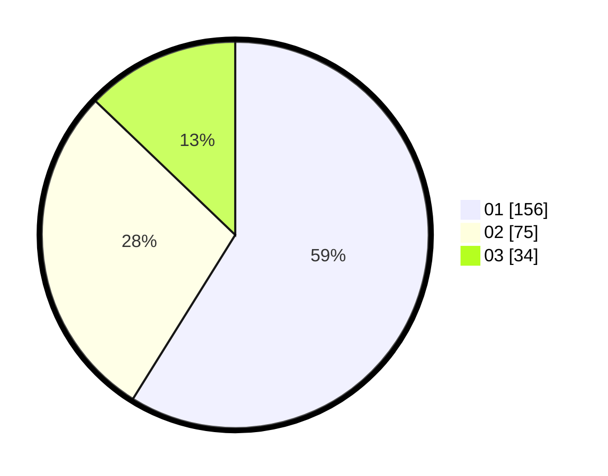

# Hasil

Hasil perolehan suara paslon dapat dilihat pada file paslon-01.txt, paslon-02.txt, dan paslon-03.txt.

Jika tidak ada, artinya data tersebut belum ada pada SIREKAP.

## Perolehan Suara

 * Paslon 01: **156**.
 * Paslon 02: **75**.
 * Paslon 03: **34**.

## Foto C Plano

https://sirekap-obj-formc.kpu.go.id/eaa6/pemilu/ppwp/31/75/07/10/03/3175071003084-20240214-192513--70091e12-e44c-4c00-a0fb-f8cdc85f565d.jpg

https://sirekap-obj-formc.kpu.go.id/eaa6/pemilu/ppwp/31/75/07/10/03/3175071003084-20240214-192630--7cb6fb30-587a-4fa2-bbca-081ea3543761.jpg

https://sirekap-obj-formc.kpu.go.id/eaa6/pemilu/ppwp/31/75/07/10/03/3175071003084-20240214-192739--7d182440-4bbb-4245-904d-9dba9877a0e4.jpg

## DATA PEMILIH TETAP

Jumlah pemilih dalam DPT: **295**.
 * L: **145**.
 * P: **150**.

## DATA PENGGUNA HAK PILIH

Jumlah pengguna hak pilih dalam DPT: **251**.
 * L: **117**.
 * P: **134**.

Jumlah pengguna hak pilih dalam DPTb: **6**.
 * L: **2**.
 * P: **4**.

Jumlah pengguna hak pilih dalam DPK: **14**.
 * L: **9**.
 * P: **5**.

Jumlah pengguna hak pilih: **271**.
 * L: **128**.
 * P: **143**.

## JUMLAH SUARA SAH DAN TIDAK SAH

JUMLAH SELURUH SUARA SAH: **265**.

JUMLAH SUARA TIDAK SAH: **6**.

JUMLAH SELURUH SUARA SAH DAN SUARA TIDAK SAH: **271**.
