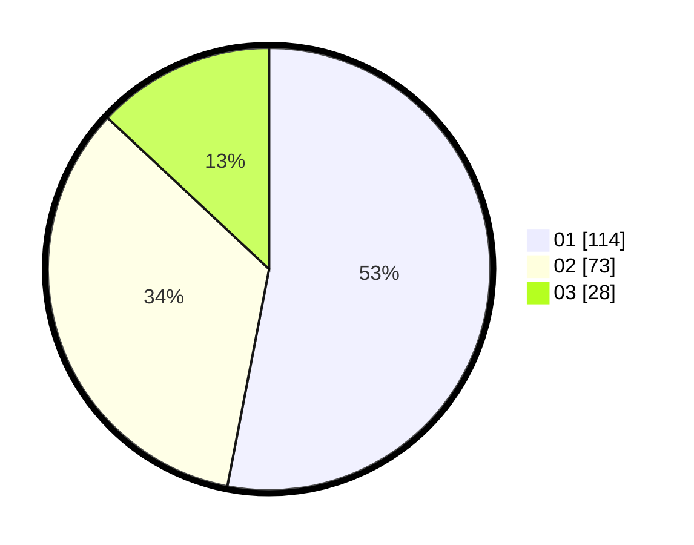

# Hasil

Hasil perolehan suara paslon dapat dilihat pada file paslon-01.txt, paslon-02.txt, dan paslon-03.txt.

Jika tidak ada, artinya data tersebut belum ada pada SIREKAP.

## Perolehan Suara

 * Paslon 01: **114**.
 * Paslon 02: **73**.
 * Paslon 03: **28**.

## Foto C Plano

https://sirekap-obj-formc.kpu.go.id/490d/pemilu/ppwp/31/75/07/10/03/3175071003091-20240216-031049--9e0aa2c2-5807-43f1-baff-239b4cd035be.jpg

https://sirekap-obj-formc.kpu.go.id/490d/pemilu/ppwp/31/75/07/10/03/3175071003091-20240216-031831--dc4034e9-dbb7-45f8-a50f-7299f7aea25f.jpg

https://sirekap-obj-formc.kpu.go.id/490d/pemilu/ppwp/31/75/07/10/03/3175071003091-20240216-031100--526cf553-92a4-4447-992f-19f4e338c99c.jpg

## DATA PEMILIH TETAP

Jumlah pemilih dalam DPT: **258**.
 * L: **130**.
 * P: **128**.

## DATA PENGGUNA HAK PILIH

Jumlah pengguna hak pilih dalam DPT: **215**.
 * L: **107**.
 * P: **108**.

Jumlah pengguna hak pilih dalam DPTb: **2**.
 * L: **2**.
 * P: **0**.

Jumlah pengguna hak pilih dalam DPK: **0**.
 * L: **0**.
 * P: **0**.

Jumlah pengguna hak pilih: **217**.
 * L: **109**.
 * P: **108**.

## JUMLAH SUARA SAH DAN TIDAK SAH

JUMLAH SELURUH SUARA SAH: **215**.

JUMLAH SUARA TIDAK SAH: **2**.

JUMLAH SELURUH SUARA SAH DAN SUARA TIDAK SAH: **217**.
