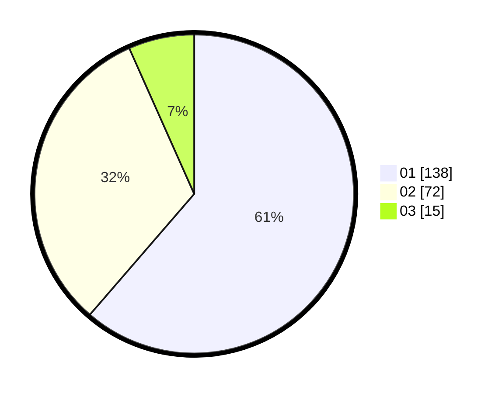

# Hasil

Hasil perolehan suara paslon dapat dilihat pada file paslon-01.txt, paslon-02.txt, dan paslon-03.txt.

Jika tidak ada, artinya data tersebut belum ada pada SIREKAP.

## Perolehan Suara

 * Paslon 01: **138**.
 * Paslon 02: **72**.
 * Paslon 03: **15**.

## Foto C Plano

https://sirekap-obj-formc.kpu.go.id/4407/pemilu/ppwp/31/75/07/10/03/3175071003102-20240214-194451--fad52eec-b932-4330-ae5e-c63d99e770fd.jpg

https://sirekap-obj-formc.kpu.go.id/4407/pemilu/ppwp/31/75/07/10/03/3175071003102-20240214-194604--2907a652-d29e-4a3b-9be2-cf94515c5a3d.jpg

https://sirekap-obj-formc.kpu.go.id/4407/pemilu/ppwp/31/75/07/10/03/3175071003102-20240214-194658--0b1a17d4-8d19-4714-b1c1-f21ec69369a4.jpg

## DATA PEMILIH TETAP

Jumlah pemilih dalam DPT: **263**.
 * L: **129**.
 * P: **134**.

## DATA PENGGUNA HAK PILIH

Jumlah pengguna hak pilih dalam DPT: **223**.
 * L: **107**.
 * P: **116**.

Jumlah pengguna hak pilih dalam DPTb: **5**.
 * L: **2**.
 * P: **3**.

Jumlah pengguna hak pilih dalam DPK: **0**.
 * L: **0**.
 * P: **0**.

Jumlah pengguna hak pilih: **228**.
 * L: **109**.
 * P: **119**.

## JUMLAH SUARA SAH DAN TIDAK SAH

JUMLAH SELURUH SUARA SAH: **225**.

JUMLAH SUARA TIDAK SAH: **3**.

JUMLAH SELURUH SUARA SAH DAN SUARA TIDAK SAH: **228**.
