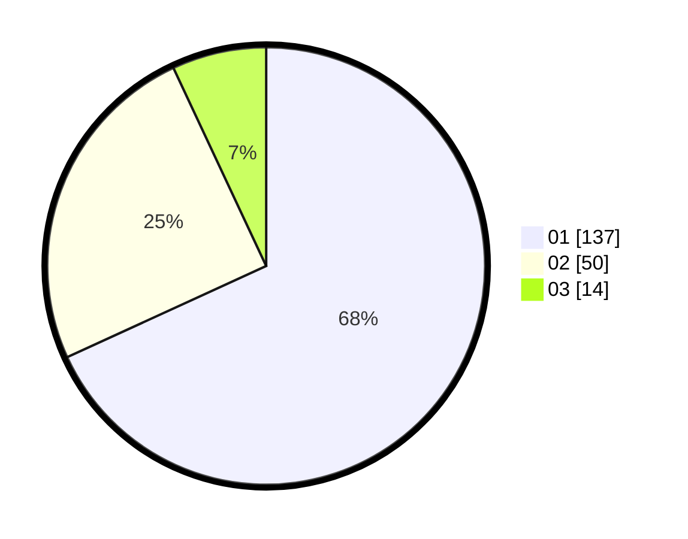

# Hasil

Hasil perolehan suara paslon dapat dilihat pada file paslon-01.txt, paslon-02.txt, dan paslon-03.txt.

Jika tidak ada, artinya data tersebut belum ada pada SIREKAP.

## Perolehan Suara

 * Paslon 01: **137**.
 * Paslon 02: **50**.
 * Paslon 03: **14**.

## Foto C Plano

https://sirekap-obj-formc.kpu.go.id/2a20/pemilu/ppwp/31/75/07/10/03/3175071003103-20240216-022059--c969396c-d8d4-466d-9f29-03e8c1847562.jpg

https://sirekap-obj-formc.kpu.go.id/2a20/pemilu/ppwp/31/75/07/10/03/3175071003103-20240216-022101--2a77db21-c9f6-428d-a42e-4579b43089e1.jpg

https://sirekap-obj-formc.kpu.go.id/2a20/pemilu/ppwp/31/75/07/10/03/3175071003103-20240216-022100--f2677e60-d347-4bd3-805f-815070682481.jpg

## DATA PEMILIH TETAP

Jumlah pemilih dalam DPT: **266**.
 * L: **124**.
 * P: **142**.

## DATA PENGGUNA HAK PILIH

Jumlah pengguna hak pilih dalam DPT: **202**.
 * L: **90**.
 * P: **112**.

Jumlah pengguna hak pilih dalam DPTb: **0**.
 * L: **0**.
 * P: **0**.

Jumlah pengguna hak pilih dalam DPK: **0**.
 * L: **0**.
 * P: **0**.

Jumlah pengguna hak pilih: **202**.
 * L: **90**.
 * P: **112**.

## JUMLAH SUARA SAH DAN TIDAK SAH

JUMLAH SELURUH SUARA SAH: **201**.

JUMLAH SUARA TIDAK SAH: **1**.

JUMLAH SELURUH SUARA SAH DAN SUARA TIDAK SAH: **202**.
